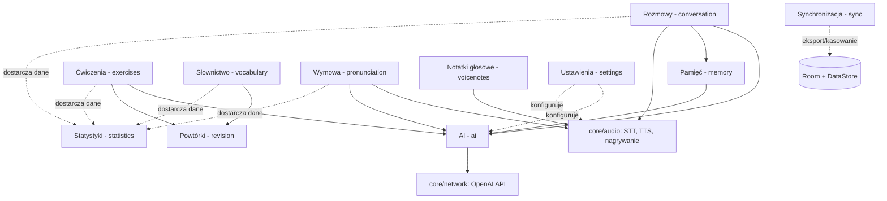

# AI English Coach — ETAP 2: Analiza funkcjonalna

> Dokument zgodny z briefem decyzji projektowych (`00-brief-decyzje-projektowe.md`).
> Moduły, ekrany i tabele wg kanonicznych nazw. Priorytet **MVP** = sprinty S0–S5,
> **Later** = roadmapa (S6+).

## 1. Moduł: Rozmowy (conversation)

Ekrany: `ConversationListScreen`, `ConversationScreen`, `ConversationSummaryScreen`.
Tabele: `conversations`, `messages`.

| ID | Funkcja | Opis | Priorytet |
|---|---|---|---|
| F-CONV-01 | Rozpoczęcie rozmowy głosowej | Start nowej rozmowy z `HomeScreen` (szybki start) lub z listy scenariuszy; utworzenie rekordu w `conversations` (status aktywny) | MVP |
| F-CONV-02 | Wybór scenariusza | Lista scenariuszy (codzienne, zawodowe, swobodna rozmowa) filtrowana pod poziom użytkownika; scenariusz zapisany w `conversations.scenario` | MVP |
| F-CONV-03 | Pętla głosowa STT→AI→TTS | Nagranie wypowiedzi (`MicButton`: idle→listening), transkrypcja przez `SpeechRecognizerManager`, odpowiedź AI (`ConversationEngine`), odczyt przez `TextToSpeechManager` (processing→speaking) | MVP |
| F-CONV-04 | Transkrypcja na żywo | Wiadomości USER/ASSISTANT wyświetlane jako `MessageBubble` w trakcie rozmowy; zapis do `messages` natychmiast po każdej turze | MVP |
| F-CONV-05 | Tłumaczenie wiadomości na polski | Na żądanie (tap na wiadomość tutora) — tłumaczenie zapisywane w `messages.translation`, dostępne potem offline | MVP |
| F-CONV-06 | Powtórne odtworzenie wiadomości (TTS) | Odsłuchanie dowolnej wiadomości tutora ponownie, z tempem z ustawień | MVP |
| F-CONV-07 | Zakończenie rozmowy | Zakończenie ustawia `endedAt`, `durationSec`, `status`; uruchamia analizę AI i `MemoryConsolidationWorker`; nawigacja do `ConversationSummaryScreen` | MVP |
| F-CONV-08 | Podsumowanie po rozmowie | Ekran analizy: podsumowanie (`conversations.summary`), lista błędów z poprawkami i wyjaśnieniami, nowe słownictwo, feedback | MVP |
| F-CONV-09 | Historia rozmów | `ConversationListScreen`: lista rozmów (tytuł, scenariusz, data, czas trwania), wejście w pełną transkrypcję i podsumowanie — offline | MVP |
| F-CONV-10 | Usuwanie rozmowy | Usunięcie rozmowy wraz z wiadomościami (kaskada); powiązane błędy/słówka pozostają | MVP |
| F-CONV-11 | Poprawa transkrypcji przed wysłaniem | Możliwość edycji rozpoznanego tekstu, gdy STT źle zrozumiał (mitygacja akcentu) | Later |
| F-CONV-12 | Tryb tekstowy awaryjny | Kontynuacja rozmowy pisaniem, gdy STT/TTS niedostępne | Later |

## 2. Moduł: Pamięć (memory)

Tabela: `ai_memories`. Worker: `MemoryConsolidationWorker`. Komponent: `MemoryManager`.

| ID | Funkcja | Opis | Priorytet |
|---|---|---|---|
| F-MEM-01 | Konsolidacja pamięci po rozmowie | `MemoryConsolidationWorker` wyciąga z transkrypcji fakty/preferencje/słabości/cele/postępy (LLM, structured JSON) i zapisuje do `ai_memories` z `importance` | MVP |
| F-MEM-02 | Embeddingi wspomnień | Każde wspomnienie dostaje embedding (`text-embedding-3-small`) zapisany w `ai_memories.embedding` (BLOB) | MVP |
| F-MEM-03 | Retrieval przed rozmową (RAG) | `MemoryManager` pobiera top-K wspomnień po podobieństwie kosinusowym do kontekstu rozmowy i wstrzykuje do system promptu | MVP |
| F-MEM-04 | Deduplikacja i aktualizacja wspomnień | Nowe fakty scalane z istniejącymi (aktualizacja `content`/`updatedAt` zamiast duplikatu) | MVP |
| F-MEM-05 | Przycinanie pamięci | Limit liczby wspomnień; usuwanie najmniej ważnych (`importance`, wiek) | Later |
| F-MEM-06 | Podgląd i edycja pamięci przez użytkownika | Lista „co AI o mnie wie" z możliwością usunięcia wpisu (prywatność) | Later |

## 3. Moduł: Ćwiczenia (exercises)

Ekrany: `ExercisesScreen`, `ExercisePlayerScreen`. Tabele: `exercises`, `exercise_attempts`, `user_errors`.

| ID | Funkcja | Opis | Priorytet |
|---|---|---|---|
| F-EX-01 | Generowanie ćwiczeń z błędów | `ExerciseGenerator` tworzy ćwiczenia z rekordów `user_errors` (sourceErrorId); typy: FILL_GAP, MULTIPLE_CHOICE, TRANSLATION, SPEAKING | MVP |
| F-EX-02 | Lista ćwiczeń due/wszystkie | `ExercisesScreen`: ćwiczenia due na dziś (wg SRS) oraz pełna lista z filtrem po typie | MVP |
| F-EX-03 | Sesja ćwiczeń | `ExercisePlayerScreen`: seria ćwiczeń jedno po drugim; obsługa wszystkich 4 typów (w tym SPEAKING przez STT) | MVP |
| F-EX-04 | Ocena odpowiedzi | Sprawdzenie odpowiedzi (lokalnie dla zamkniętych; AI dla TRANSLATION/SPEAKING), zapis do `exercise_attempts`, pokazanie wyjaśnienia | MVP |
| F-EX-05 | Aktualizacja SRS po odpowiedzi | Wynik próby mapowany na ocenę SM-2 → aktualizacja `easeFactor`, `intervalDays`, `repetitionCount`, `dueAt` | MVP |
| F-EX-06 | Oznaczenie błędu jako rozwiązanego | Po serii poprawnych odpowiedzi źródłowy `user_errors.resolvedAt` ustawiany — widoczny postęp | MVP |
| F-EX-07 | Ręczne generowanie dodatkowych ćwiczeń | „Daj mi więcej ćwiczeń z tego błędu/tematu" na żądanie | Later |

## 4. Moduł: Powtórki (revision)

Worker: `RevisionSchedulerWorker`. Algorytm: SM-2 (`easeFactor` start 2.5, oceny 0–5, intervalDays 1→6→EF*n).

| ID | Funkcja | Opis | Priorytet |
|---|---|---|---|
| F-REV-01 | Silnik SM-2 | Wspólna implementacja SM-2 dla `vocabulary_items` i `exercises` (easeFactor, intervalDays, repetitionCount, dueAt) | MVP |
| F-REV-02 | Codzienne wyznaczanie powtórek due | `RevisionSchedulerWorker` (WorkManager, codziennie) wyznacza elementy z `dueAt <= dziś` | MVP |
| F-REV-03 | Powiadomienie o powtórkach | Powiadomienie push (za zgodą z onboardingu) z liczbą powtórek due | MVP |
| F-REV-04 | Sekcja „powtórki due" na Home | `HomeScreen` pokazuje liczbę słówek i ćwiczeń do powtórki z bezpośrednim wejściem w sesję | MVP |
| F-REV-05 | Konfiguracja pory powiadomień | Wybór godziny przypomnienia w ustawieniach | Later |

## 5. Moduł: Słownictwo (vocabulary)

Ekrany: `VocabularyScreen`, `VocabularyReviewScreen`. Tabela: `vocabulary_items`.

| ID | Funkcja | Opis | Priorytet |
|---|---|---|---|
| F-VOC-01 | Automatyczne wykrywanie słówek z rozmów | Analiza AI po rozmowie wyodrębnia nowe/trudne słowa z tłumaczeniem, definicją i przykładem (`sourceConversationId`) | MVP |
| F-VOC-02 | Ręczne dodanie słówka | Dodanie własnego słowa; AI uzupełnia tłumaczenie/definicję/przykład | MVP |
| F-VOC-03 | Lista słówek z filtrami | `VocabularyScreen`: filtrowanie po statusie (NEW/LEARNING/MASTERED), źródle, dacie; wyszukiwanie | MVP |
| F-VOC-04 | Fiszki SRS | `VocabularyReviewScreen`: sesja fiszek (słowo↔tłumaczenie, przykład), samoocena 0–5 → aktualizacja SM-2 | MVP |
| F-VOC-05 | Statusy opanowania | Automatyczna zmiana NEW→LEARNING→MASTERED na podstawie historii powtórek | MVP |
| F-VOC-06 | Odsłuch wymowy słówka (TTS) | Odtworzenie słowa i przykładu głosem TTS z fiszki i z listy | MVP |
| F-VOC-07 | Skierowanie słówka do treningu wymowy | Przycisk „ćwicz wymowę" prowadzący do `PronunciationScreen` z tym słowem | Later |

## 6. Moduł: Wymowa (pronunciation)

Ekran: `PronunciationScreen`. Tabela: `pronunciation_results`.

| ID | Funkcja | Opis | Priorytet |
|---|---|---|---|
| F-PRON-01 | Trening wymowy słowa | Użytkownik słyszy wzorzec (TTS), wymawia słowo; STT rozpoznaje (`recognizedText` vs `expectedText`) | MVP |
| F-PRON-02 | Ocena wymowy 0–100 | Wynik łączący confidence STT i zgodność tekstu; feedback AI z konkretną wskazówką („th jak w think…") | MVP |
| F-PRON-03 | Dobór słów do treningu | Kolejka słów: z błędów PRONUNCIATION, ze słabych wyników, ze słownictwa użytkownika | MVP |
| F-PRON-04 | Historia wyników wymowy | Lista prób z wynikami i trendem per słowo (`pronunciation_results`) | MVP |
| F-PRON-05 | Ponowna próba i porównanie | Natychmiastowe „spróbuj jeszcze raz" z porównaniem do poprzedniego wyniku | MVP |
| F-PRON-06 | Analiza wymowy na poziomie zdań | Trening całych fraz/zdań, nie tylko pojedynczych słów | Later |

## 7. Moduł: Notatki głosowe (voicenotes)

Ekran: `VoiceNotesScreen`. Tabela: `voice_notes`.

| ID | Funkcja | Opis | Priorytet |
|---|---|---|---|
| F-NOTE-01 | Nagrywanie notatki głosowej | Nagranie audio (`AudioRecorder`), zapis pliku (`audioPath`) i metadanych (`durationSec`) | MVP |
| F-NOTE-02 | Automatyczna transkrypcja | Transkrypcja nagrania (STT) zapisywana w `voice_notes.transcription`; tytuł proponowany z treści | MVP |
| F-NOTE-03 | Lista i odtwarzanie notatek | Lista notatek z tytułem, datą, czasem trwania; odtwarzanie audio i podgląd transkrypcji — offline | MVP |
| F-NOTE-04 | Usuwanie notatki | Usunięcie rekordu wraz z plikiem audio | MVP |
| F-NOTE-05 | Notatka → materiał do nauki | Przekazanie transkrypcji do AI: „jak to powiedzieć lepiej po angielsku" / wyciągnięcie słówek | Later |

## 8. Moduł: Statystyki (statistics)

Ekran: `StatisticsScreen` (+ elementy na `HomeScreen`). Tabela: `daily_stats`.

| ID | Funkcja | Opis | Priorytet |
|---|---|---|---|
| F-STAT-01 | Agregacja statystyk dziennych | Zapis do `daily_stats`: sekundy rozmów, wiadomości, nowe słówka, ćwiczenia (wykonane/poprawne), średnia wymowy | MVP |
| F-STAT-02 | Streak i cel dzienny | Licznik dni z rzędu z aktywnością; postęp celu dziennego (minuty) na `HomeScreen` (`ProgressRing`) | MVP |
| F-STAT-03 | Wykresy postępów | `StatisticsScreen`: wykresy tygodniowe/miesięczne (minuty rozmów, słówka, skuteczność ćwiczeń, wymowa) | MVP |
| F-STAT-04 | Wskaźniki zbiorcze | `StatTile`: łączny czas rozmów, liczba rozmów, opanowane słówka, rozwiązane błędy | MVP |
| F-STAT-05 | Tygodniowy raport AI | LLM generuje tekstowe podsumowanie tygodnia ze statystyk (mocne strony, słabości, rekomendacje) | Later |

## 9. Moduł: Ustawienia (settings)

Ekrany: `SettingsScreen`, `SettingsAiScreen`, `SettingsProfileScreen`, `SettingsDataScreen`. Storage: DataStore `UserPreferences`.

| ID | Funkcja | Opis | Priorytet |
|---|---|---|---|
| F-SET-01 | Profil nauki | Edycja poziomu (A2–C1), celów nauki, celu dziennego (minuty) — `SettingsProfileScreen` | MVP |
| F-SET-02 | Konfiguracja klucza API | Wpisanie/zmiana klucza OpenAI, walidacja testowym wywołaniem, zapis szyfrowany (security-crypto) — `SettingsAiScreen` | MVP |
| F-SET-03 | Wybór modelu AI | Wybór modelu (domyślnie `gpt-4o-mini`) — `SettingsAiScreen` | MVP |
| F-SET-04 | Głos i tempo TTS | Wybór głosu (US/GB) i regulacja tempa mowy z podglądem — `SettingsAiScreen` | MVP |
| F-SET-05 | Motyw | Light/Dark/systemowy + dynamic color (Android 12+) | MVP |
| F-SET-06 | Zarządzanie danymi | Wejście do eksportu i kasowania danych — `SettingsDataScreen` (realizacja w module sync) | MVP |
| F-SET-07 | Zgody prywatności | Podgląd/zmiana opt-in na wysyłkę treści do AI; link do polityki prywatności | MVP |

## 10. Moduł: Synchronizacja (sync)

Ekran: `SettingsDataScreen`.

| ID | Funkcja | Opis | Priorytet |
|---|---|---|---|
| F-SYNC-01 | Eksport danych do JSON | Pełny eksport danych (rozmowy, słówka, ćwiczenia, statystyki, notatki-metadane) do lokalnego pliku JSON; bez klucza API | MVP |
| F-SYNC-02 | Kasowanie wszystkich danych | Nieodwracalne usunięcie bazy Room, DataStore i plików audio z potwierdzeniem | MVP |
| F-SYNC-03 | Import z pliku eksportu | Odtworzenie danych z wcześniejszego eksportu JSON | Later |
| F-SYNC-04 | Synchronizacja chmurowa | Konto + sync między urządzeniami | Later (S6) |
| F-SYNC-05 | Aktualizacje in-app | Play In-App Updates | Later (S6) |

## 11. Moduł: AI (ai)

Komponenty: klient OpenAI (`core/network` + `core/ai`), prompty, `ConversationEngine`, analiza, generatory, embeddings.

| ID | Funkcja | Opis | Priorytet |
|---|---|---|---|
| F-AI-01 | Klient OpenAI Chat Completions | Retrofit/OkHttp, `POST /v1/chat/completions`, obsługa błędów (401/429/5xx), retry z backoff | MVP |
| F-AI-02 | ConversationEngine | Budowa promptu rozmowy: rola tutora, poziom i cele użytkownika, scenariusz, wspomnienia (RAG), okno ostatnich N wiadomości | MVP |
| F-AI-03 | Analiza rozmowy (structured output) | Po rozmowie LLM zwraca JSON: błędy (kategoria/oryginał/poprawka/wyjaśnienie), słownictwo, podsumowanie, feedback | MVP |
| F-AI-04 | ExerciseGenerator | Generowanie ćwiczeń 4 typów z `user_errors` (structured JSON) | MVP |
| F-AI-05 | Konsolidacja pamięci | Prompt ekstrakcji wspomnień (kind: FACT/PREFERENCE/WEAKNESS/GOAL/PROGRESS) — używany przez F-MEM-01 | MVP |
| F-AI-06 | Klient Embeddings | `POST /v1/embeddings` (`text-embedding-3-small`) dla pamięci RAG | MVP |
| F-AI-07 | Feedback wymowy | Prompt oceny wymowy (expected vs recognized + confidence) ze wskazówką | MVP |
| F-AI-08 | Tłumaczenia | Tłumaczenie wiadomości tutora na polski (F-CONV-05) | MVP |
| F-AI-09 | Generator raportu tygodniowego | Podsumowanie postępów ze statystyk (F-STAT-05) | Later |
| F-AI-10 | Whisper STT / OpenAI TTS | Alternatywne silniki mowy | Later (S6) |

## 12. Zależności między modułami

Zgodnie z briefem: conversation → ai, memory, audio; exercises → ai, revision;
vocabulary → revision; pronunciation → audio, ai; statistics ← wszystkie; memory → ai.

| Moduł | Zależy od | Dostarcza do |
|---|---|---|
| conversation | ai, memory, audio | statistics, vocabulary (nowe słówka), exercises (błędy przez user_errors), memory (transkrypcje) |
| memory | ai (LLM + embeddings) | conversation (kontekst RAG) |
| exercises | ai (generator, ocena), revision (SRS) | statistics |
| revision | — (silnik SM-2 + WorkManager) | exercises, vocabulary, home (due) |
| vocabulary | revision (SRS), ai (wzbogacanie) | statistics, pronunciation (słowa do treningu) |
| pronunciation | audio (STT/TTS), ai (feedback) | statistics |
| voicenotes | audio (nagrywanie, STT) | statistics (opcjonalnie), ai (Later: materiał do nauki) |
| statistics | dane ze wszystkich modułów | home (streak, cel), ai (Later: raport tygodniowy) |
| settings | datastore | ai (model, klucz), audio (głos, tempo), cały produkt (profil, motyw) |
| sync | database, datastore | — |
| ai | network | conversation, memory, exercises, pronunciation, vocabulary, statistics |
