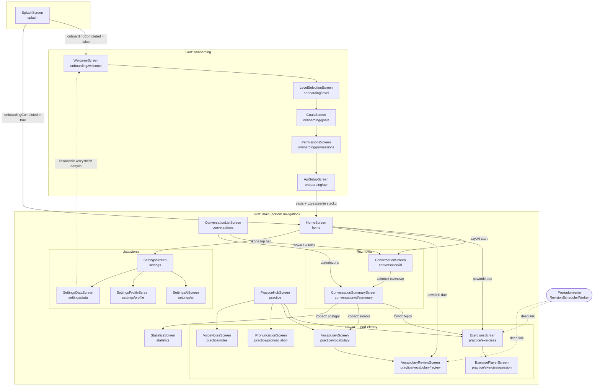
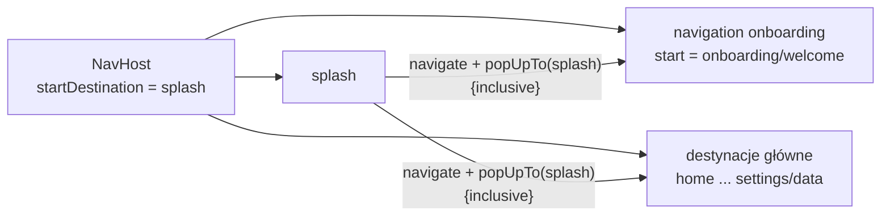
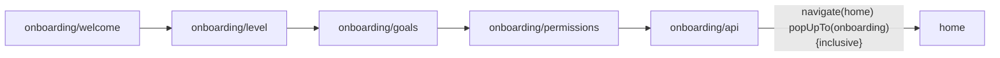
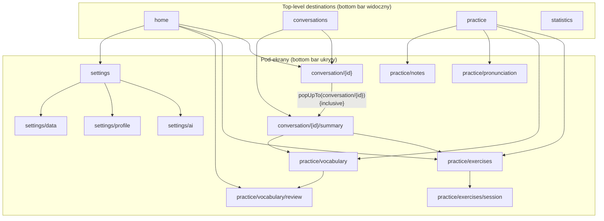

# ETAP 4 — Architektura informacji (IA)

> Dokument bazuje na [00-brief-decyzje-projektowe.md](./00-brief-decyzje-projektowe.md) —
> wszystkie nazwy ekranów, routes i modułów są z nim zgodne 1:1.

## 1. Pełna lista ekranów

Aplikacja ma **22 ekrany** w 6 grupach funkcjonalnych: start (splash), onboarding (5),
zakładki główne (4), rozmowy (2 pod-ekrany), nauka (6 pod-ekranów), ustawienia (4).

| # | Ekran | Route | Cel ekranu | Wejścia (skąd) | Wyjścia (dokąd) |
|---|---|---|---|---|---|
| 1 | SplashScreen | `splash` | decyzja startowa: onboarding czy home (odczyt `onboardingCompleted` z DataStore) | uruchomienie aplikacji (start destination) | `onboarding/welcome` **lub** `home` (z wyczyszczeniem back stacku) |
| 2 | WelcomeScreen | `onboarding/welcome` | wprowadzenie do produktu, propozycja wartości | `splash` | `onboarding/level` |
| 3 | LevelSelectionScreen | `onboarding/level` | samoocena poziomu A2–C1 | `onboarding/welcome` | `onboarding/goals`; back → `onboarding/welcome` |
| 4 | GoalsScreen | `onboarding/goals` | wybór celów nauki + cel dzienny (minuty) | `onboarding/level` | `onboarding/permissions`; back → `onboarding/level` |
| 5 | PermissionsScreen | `onboarding/permissions` | uzyskanie uprawnień: mikrofon (wymagany), powiadomienia (opcjonalne) | `onboarding/goals` | `onboarding/api`; back → `onboarding/goals` |
| 6 | ApiSetupScreen | `onboarding/api` | konfiguracja klucza OpenAI + walidacja | `onboarding/permissions`; `settings/ai` (kontekst „napraw klucz") | `home` (koniec onboardingu, czyszczenie back stacku); back → `onboarding/permissions` |
| 7 | HomeScreen | `home` | dashboard: streak, cel dzienny, szybki start rozmowy, powtórki due | `splash`, `onboarding/api`, zakładka **Home**, koniec przepływu rozmowy | `conversation/{id}` (szybki start), `practice/exercises` / `practice/vocabulary/review` (karta powtórek due), `settings` (ikona top bar), pozostałe zakładki |
| 8 | ConversationListScreen | `conversations` | historia rozmów, start nowej rozmowy | zakładka **Rozmowy** | `conversation/{id}` (nowa/istniejąca), `conversation/{id}/summary` (rozmowa zakończona) |
| 9 | ConversationScreen | `conversation/{id}` | aktywna rozmowa głosowa STT→AI→TTS | `home` (szybki start), `conversations` | `conversation/{id}/summary` (po zakończeniu; `popUpTo` usuwa rozmowę ze stacku); back → dialog potwierdzenia zakończenia |
| 10 | ConversationSummaryScreen | `conversation/{id}/summary` | analiza po rozmowie: błędy, nowe słówka, feedback, ocena | `conversation/{id}` (auto po zakończeniu), `conversations` (rozmowa historyczna) | `practice/exercises` (CTA „Ćwicz błędy"), `practice/vocabulary` (CTA „Zobacz słówka"), back → ekran źródłowy (`home` lub `conversations`) |
| 11 | PracticeHubScreen | `practice` | hub modułów nauki: ćwiczenia, słownictwo, wymowa, notatki | zakładka **Nauka** | `practice/exercises`, `practice/vocabulary`, `practice/pronunciation`, `practice/notes` |
| 12 | ExercisesScreen | `practice/exercises` | lista ćwiczeń due / wszystkie, start sesji | `practice`, `home` (karta due), `conversation/{id}/summary` (CTA), deep link z powiadomienia | `practice/exercises/session`; back → `practice` |
| 13 | ExercisePlayerScreen | `practice/exercises/session` | wykonywanie serii ćwiczeń + ocena SM-2 | `practice/exercises` | ekran wyniku sesji (w ramach route) → back do `practice/exercises`; back w trakcie → dialog przerwania |
| 14 | VocabularyScreen | `practice/vocabulary` | lista słówek + filtry (status, źródło), dodawanie ręczne | `practice`, `conversation/{id}/summary` (CTA) | `practice/vocabulary/review`; arkusz szczegółu/dodania słówka (bottom sheet); back → `practice` |
| 15 | VocabularyReviewScreen | `practice/vocabulary/review` | fiszki SRS (swipe + samoocena) | `practice/vocabulary`, `home` (karta due), deep link z powiadomienia | ekran wyniku sesji → back do `practice/vocabulary`; back w trakcie → dialog przerwania |
| 16 | PronunciationScreen | `practice/pronunciation` | trening wymowy: odsłuch wzorca, nagranie, wynik 0–100 | `practice`, `conversation/{id}/summary` (błędy PRONUNCIATION) | pozostaje na ekranie (pętla treningu); back → `practice` |
| 17 | VoiceNotesScreen | `practice/notes` | nagrywanie i lista notatek głosowych z transkrypcją | `practice` | arkusz odtwarzania/szczegółu notatki (bottom sheet); back → `practice` |
| 18 | StatisticsScreen | `statistics` | wykresy i wskaźniki: streak, minuty, słówka, skuteczność, raport tygodniowy | zakładka **Statystyki**, `conversation/{id}/summary` (CTA „Zobacz postępy") | brak nawigacji dalej (ekran liściowy zakładki) |
| 19 | SettingsScreen | `settings` | lista sekcji ustawień | ikona ⚙ w top barze `home` | `settings/ai`, `settings/profile`, `settings/data`; back → `home` |
| 20 | SettingsAiScreen | `settings/ai` | model AI, klucz API, głos i tempo TTS | `settings`, banner błędu API (skrót „Napraw") | back → `settings` |
| 21 | SettingsProfileScreen | `settings/profile` | zmiana poziomu (A2–C1) i celów nauki | `settings` | back → `settings` |
| 22 | SettingsDataScreen | `settings/data` | eksport JSON, kasowanie danych | `settings` | back → `settings`; po kasowaniu wszystkiego → `onboarding/welcome` (reset) |

## 2. Relacje między ekranami



Legenda: linie ciągłe — nawigacja jawna (akcja użytkownika lub automatyczna),
linie przerywane — przejścia wyjątkowe (deep link, reset danych).

## 3. Struktura menu

### 3.1. Bottom navigation (4 zakładki)

Zakładki widoczne **wyłącznie** na czterech ekranach korzeniach (top-level destinations).
Znikają na pod-ekranach (rozmowa, sesje ćwiczeń, ustawienia) — pełne skupienie na zadaniu.

| Zakładka | Etykieta | Ikona (Material Symbols Rounded) | Route korzenia | Badge |
|---|---|---|---|---|
| 1 | Home | `home` | `home` | — |
| 2 | Rozmowy | `forum` | `conversations` | — |
| 3 | Nauka | `school` | `practice` | liczba powtórek due (kropka + licznik, max „99+") |
| 4 | Statystyki | `monitoring` | `statistics` | — |

Zachowanie zakładek (wzorzec Now in Android):

- tap na inną zakładkę → `navigate` z `popUpTo(home) { saveState = true }`,
  `launchSingleTop = true`, `restoreState = true` — stan każdej zakładki (scroll,
  filtry) jest zachowywany;
- ponowny tap na aktywną zakładkę → powrót do korzenia zakładki i scroll do góry;
- systemowy back z zakładki innej niż Home → powrót do Home; back z Home → wyjście z aplikacji.

### 3.2. Top bar (`CoachTopBar`)

| Ekran | Tytuł | Akcje po lewej | Akcje po prawej |
|---|---|---|---|
| HomeScreen | „AI English Coach" | — | ikona ⚙ → `settings` |
| ConversationListScreen | „Rozmowy" | — | wyszukiwanie (rozwijane pole) |
| ConversationScreen | nazwa scenariusza + timer sesji | ✕ (zakończ → dialog) | ikona ⌨ (tryb pisania) |
| ConversationSummaryScreen | „Podsumowanie rozmowy" | ← back | udostępnij (eksport tekstu) |
| PracticeHubScreen | „Nauka" | — | — |
| Ekrany `practice/*` | tytuł sekcji | ← back | zależne od ekranu (filtr, sortowanie) |
| ExercisePlayerScreen / VocabularyReviewScreen | postęp „3 / 10" + pasek | ✕ (przerwij → dialog) | — |
| StatisticsScreen | „Statystyki" | — | wybór zakresu (7 / 30 dni) |
| SettingsScreen i pod-ekrany | tytuł sekcji | ← back | — |

### 3.3. Menu kontekstowe i akcje drugorzędne

| Miejsce | Wywołanie | Pozycje |
|---|---|---|
| `MessageBubble` (ConversationScreen, Summary) | long-press | Przetłumacz · Zapisz słówko · Odtwórz ponownie (TTS) · Kopiuj |
| element listy w ConversationListScreen | long-press | Zmień tytuł · Usuń rozmowę |
| element listy w VocabularyScreen | long-press | Edytuj · Oznacz jako opanowane · Usuń |
| element listy w VoiceNotesScreen | long-press | Zmień tytuł · Udostępnij transkrypcję · Usuń |
| VocabularyScreen | FAB „+" | bottom sheet dodania słówka ręcznie |
| ConversationListScreen | FAB „Nowa rozmowa" | bottom sheet wyboru scenariusza |

## 4. Struktura nawigacji (Navigation Compose)

### 4.1. Definicja routes (kanoniczne stałe)

```kotlin
// app/src/main/kotlin/com/aienglishcoach/navigation/CoachRoutes.kt
object CoachRoutes {
    const val SPLASH = "splash"

    const val ONBOARDING_GRAPH = "onboarding"          // route grafu zagnieżdżonego
    const val ONBOARDING_WELCOME = "onboarding/welcome"
    const val ONBOARDING_LEVEL = "onboarding/level"
    const val ONBOARDING_GOALS = "onboarding/goals"
    const val ONBOARDING_PERMISSIONS = "onboarding/permissions"
    const val ONBOARDING_API = "onboarding/api"

    const val HOME = "home"
    const val CONVERSATIONS = "conversations"
    const val CONVERSATION = "conversation/{id}"
    const val CONVERSATION_SUMMARY = "conversation/{id}/summary"
    const val PRACTICE = "practice"
    const val EXERCISES = "practice/exercises"
    const val EXERCISE_SESSION = "practice/exercises/session"
    const val VOCABULARY = "practice/vocabulary"
    const val VOCABULARY_REVIEW = "practice/vocabulary/review"
    const val PRONUNCIATION = "practice/pronunciation"
    const val VOICE_NOTES = "practice/notes"
    const val STATISTICS = "statistics"
    const val SETTINGS = "settings"
    const val SETTINGS_AI = "settings/ai"
    const val SETTINGS_PROFILE = "settings/profile"
    const val SETTINGS_DATA = "settings/data"
}
```

### 4.2. Graf nadrzędny



`splash` jest zawsze usuwany ze stacku po podjęciu decyzji — użytkownik nigdy nie
wraca na SplashScreen przyciskiem back.

### 4.3. Graf onboardingu



Zasady:

- graf zagnieżdżony `navigation(route = "onboarding", startDestination = "onboarding/welcome")`
  w module `feature/onboarding`;
- back cofa liniowo po krokach (welcome ← level ← goals ← permissions ← api);
  back z `onboarding/welcome` zamyka aplikację;
- wybory z każdego kroku zapisywane do DataStore natychmiast (przerwany onboarding
  wznawia się od `onboarding/welcome`, ale z wypełnionymi wartościami);
- zakończenie: zapis `onboardingCompleted = true` → `navigate(HOME)` z
  `popUpTo(ONBOARDING_GRAPH) { inclusive = true }` — cały onboarding znika ze stacku;
- wejście ponowne do `onboarding/api` możliwe tylko jako pojedynczy krok z kontekstu
  ustawień/błędu API (argument `standalone=true`, wyjście przez back, bez czyszczenia stacku).

### 4.4. Graf główny (zakładki + pod-ekrany)



Argumenty tras:

| Route | Argument | Typ | Uwagi |
|---|---|---|---|
| `conversation/{id}` | `id` | Long | `id = -1` (lub `new`) → utworzenie nowej rozmowy; opcjonalny query param `?scenario=` |
| `conversation/{id}/summary` | `id` | Long | wymagany |
| `practice/exercises` | `?filter=` | String? | `due` (deep link) lub `all` (domyślnie) |
| `onboarding/api` | `?standalone=` | Boolean | `true` przy wejściu z ustawień/naprawy klucza |

### 4.5. Deep linki

Host: `aienglishcoach://` (schemat aplikacji, `autoVerify` nie jest wymagane dla MVP).

| Deep link | Cel | Źródło | Syntetyczny back stack |
|---|---|---|---|
| `aienglishcoach://practice/exercises?filter=due` | ExercisesScreen (filtr due) | powiadomienie `RevisionSchedulerWorker` — powtórki ćwiczeń | `home` → `practice` → `practice/exercises` |
| `aienglishcoach://practice/vocabulary/review` | VocabularyReviewScreen | powiadomienie `RevisionSchedulerWorker` — fiszki due | `home` → `practice` → `practice/vocabulary` → `practice/vocabulary/review` |
| `aienglishcoach://conversation/{id}/summary` | ConversationSummaryScreen | powiadomienie `MemoryConsolidationWorker` „analiza gotowa" (gdy użytkownik opuścił ekran przed końcem analizy) | `home` → `conversations` → `conversation/{id}/summary` |
| `aienglishcoach://home` | HomeScreen | powiadomienie streak reminder | tylko `home` |

Zasady deep linków:

- Navigation Compose buduje syntetyczny back stack zgodnie z hierarchią grafu —
  back z celu deep linku prowadzi w głąb aplikacji (do rodzica), nie na launcher;
- jeżeli `onboardingCompleted = false`, deep link jest ignorowany i użytkownik trafia
  na `splash` → onboarding (guard w `MainActivity` przed obsłużeniem intentu);
- powiadomienia używają `PendingIntent` z `TaskStackBuilder` odtwarzającym stack.

### 4.6. Back stack — zachowania kanoniczne

| Sytuacja | Zachowanie |
|---|---|
| back na `home` | wyjście z aplikacji (bez dialogu) |
| back na zakładce innej niż Home | powrót do `home` (zachowanie domyślne bottom nav M3) |
| back na `conversation/{id}` w trakcie rozmowy | **przechwycony** (`BackHandler`): dialog „Zakończyć rozmowę?" — [Zakończ i analizuj] / [Odrzuć] / [Wróć do rozmowy] |
| zakończenie rozmowy | `navigate(summary)` z `popUpTo(conversation/{id}) { inclusive = true }` — back z podsumowania nie wraca do martwej rozmowy |
| back na `conversation/{id}/summary` | powrót do ekranu źródłowego (`home` lub `conversations`) |
| back w `practice/exercises/session` i `practice/vocabulary/review` w trakcie sesji | **przechwycony**: dialog „Przerwać sesję? Postęp ocenionych kart zostanie zapisany." |
| zakończenie sesji ćwiczeń/fiszek | ekran wyniku w ramach tego samego route; przycisk [Gotowe] i back → `popBackStack()` do listy |
| back z `settings/*` | powrót do `settings`, potem `home` |
| kasowanie wszystkich danych (`settings/data`) | `navigate(onboarding)` z `popUpTo(0) { inclusive = true }` — pełny reset stacku |
| process death | Navigation Compose odtwarza stack z `SavedState`; `ConversationScreen` po odtworzeniu pokazuje stan `PAUSED` z opcją wznowienia (rozmowa i wiadomości są w Room) |

### 4.7. Własność grafów (moduły Gradle)

| Graf / destynacje | Moduł | Funkcja rozszerzająca |
|---|---|---|
| `splash` | `app` | inline w `CoachNavHost` |
| graf `onboarding` | `feature/onboarding` | `NavGraphBuilder.onboardingGraph(...)` |
| `home` | `feature/home` | `NavGraphBuilder.homeScreen(...)` |
| `conversations`, `conversation/{id}`, `conversation/{id}/summary` | `feature/conversation` | `NavGraphBuilder.conversationGraph(...)` |
| `practice` + 6 pod-ekranów | `feature/practice` | `NavGraphBuilder.practiceGraph(...)` |
| `statistics` | `feature/statistics` | `NavGraphBuilder.statisticsScreen(...)` |
| `settings` + 3 pod-ekrany | `feature/settings` | `NavGraphBuilder.settingsGraph(...)` |

Moduły feature nie znają się nawzajem — nawigację między featurami spina `app`
poprzez lambdy `onNavigateTo...` przekazywane do funkcji grafów.
