# ETAP 5 — User Flow

> Dokument bazuje na [00-brief-decyzje-projektowe.md](./00-brief-decyzje-projektowe.md)
> oraz [04-architektura-informacji.md](./04-architektura-informacji.md). Nazwy ekranów
> i routes są kanoniczne.

Konwencja: każdy przepływ ma diagram mermaid + opis kroków z wariantami
**happy path** / **edge case**. Stany MicButton (idle/listening/processing/speaking)
opisane szczegółowo w [06-ux.md](./06-ux.md).

---

## F1. Przepływ główny — pierwsze uruchomienie → pełna pętla nauki

Najważniejszy przepływ produktu: od instalacji do zamknięcia pełnej pętli
rozmowa → analiza → ćwiczenia → powtórki → statystyki → kolejna sesja.

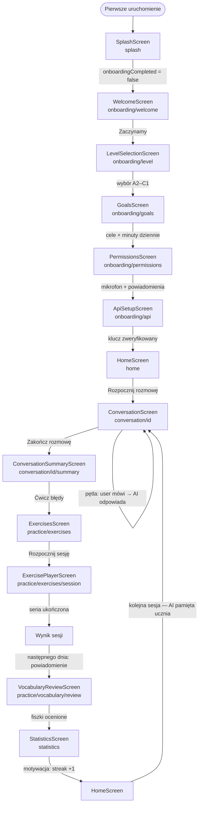

Kroki:

1. **SplashScreen** — odczyt DataStore (< 500 ms). `onboardingCompleted = false` →
   onboarding; splash usuwany ze stacku.
2. **WelcomeScreen** — 2–3 plansze wartości produktu (rozmowy głosowe, AI pamięta,
   spersonalizowane powtórki). CTA „Zaczynamy".
3. **LevelSelectionScreen** — samoocena poziomu: 4 karty `LevelChip` (A2/B1/B2/C1)
   z opisem „co potrafisz" po polsku. Wybór zapisywany od razu do DataStore.
4. **GoalsScreen** — multi-select celów (praca, podróże, egzaminy, small talk,
   emigracja) + slider celu dziennego (5/10/15/20 min, domyślnie 10).
5. **PermissionsScreen** — wyjaśnienie *zanim* pojawi się systemowy dialog:
   mikrofon (wymagany do rozmów), powiadomienia (opcjonalne — przypomnienia o powtórkach).
   Edge case → **F3** (odmowa mikrofonu). Odmowa powiadomień nie blokuje przejścia dalej.
6. **ApiSetupScreen** — pole klucza `sk-...`, link „Skąd wziąć klucz?", przycisk
   [Zweryfikuj i zapisz] wykonuje testowy request; sukces → zapis w szyfrowanym
   storage, `onboardingCompleted = true`, nawigacja do `home` z czyszczeniem stacku.
   Edge case: klucz niepoprawny (401) → inline error „Klucz wygląda na nieprawidłowy";
   brak sieci → „Sprawdź połączenie i spróbuj ponownie".
7. **HomeScreen** (stan zerowy) — streak 0, pierścień celu dziennego 0/10 min,
   duży CTA „Rozpocznij pierwszą rozmowę", sekcja powtórek pusta („Pojawią się po
   pierwszej rozmowie").
8. **ConversationScreen** — AI otwiera rozmowę głosowo (scenariusz dobrany do poziomu
   i celów z onboardingu). Pętla: MicButton `listening` → transkrypcja na żywo →
   `processing` → odpowiedź AI `speaking` → auto-powrót do `listening`.
   Wszystkie wiadomości zapisywane do Room na bieżąco.
9. **Zakończenie** — użytkownik: ✕ / back → dialog → [Zakończ i analizuj].
   Analiza AI (błędy, słówka, feedback) → **ConversationSummaryScreen**: ocena rozmowy,
   lista błędów (kategoria, oryginał, poprawka, wyjaśnienie), nowe słówka, CTA.
10. **ExercisesScreen → ExercisePlayerScreen** — ćwiczenia wygenerowane z błędów
    (FILL_GAP / MULTIPLE_CHOICE / TRANSLATION / SPEAKING); każda odpowiedź oceniana,
    SM-2 wyznacza `dueAt`. Wynik sesji: X/Y poprawnych, następna powtórka „jutro".
11. **Następny dzień** — `RevisionSchedulerWorker` wysyła powiadomienie → deep link
    do **VocabularyReviewScreen** (przepływ **F6**). Fiszki: swipe/samoocena 0–5.
12. **StatisticsScreen** — streak 2, minuty rozmów, nowe słówka, skuteczność ćwiczeń.
13. **Kolejna sesja** — `MemoryManager` wstrzykuje do promptu pamięć (cele, słabości,
    fakty) → rozmowa jest lepiej spersonalizowana. Pętla się zamyka.

---

## F2. Powracający użytkownik (codzienna sesja)

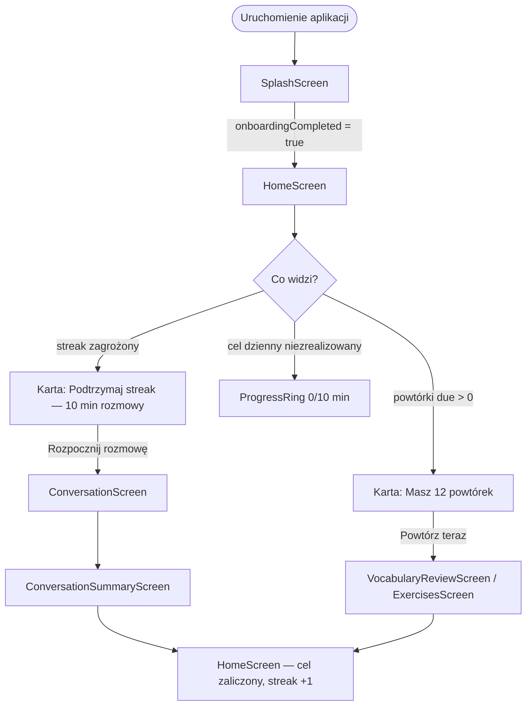

- **Happy path:** splash → home w < 2 s (cold start, wymaganie niefunkcjonalne);
  Home priorytetyzuje **jedną** najważniejszą akcję dnia (rozmowa, jeśli cel
  niezrealizowany; powtórki, jeśli rozmowa odbyta).
- **Edge case — długa nieobecność (7+ dni):** karta „Witaj z powrotem" z łagodnym
  komunikatem (bez karania), skumulowane powtórki ograniczone do sensownej porcji
  (max 20 na sesję), reszta przesunięta.
- **Edge case — klucz API przestał działać:** pierwsza akcja AI kończy się 401 →
  banner na Home „Problem z kluczem API — [Napraw]" → `settings/ai`.

---

## F3. Odmowa uprawnienia mikrofonu

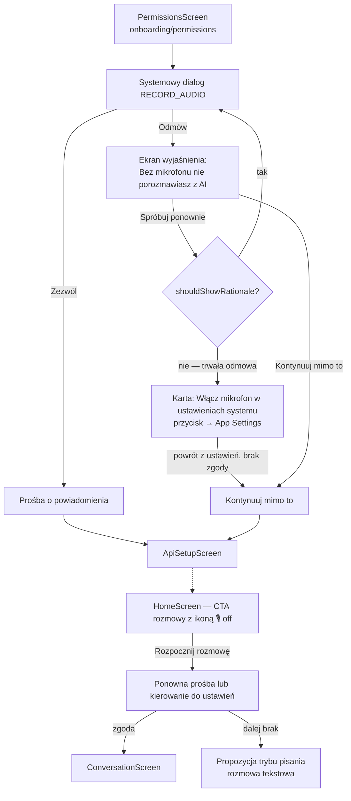

- **Happy path:** zgoda za pierwszym razem, przejście płynne.
- **Edge case — pierwsza odmowa:** ekran nieblokujący z uzasadnieniem; ponowna prośba
  możliwa (system pokaże dialog dopóki nie wybrano „nie pytaj ponownie" / drugiej odmowy).
- **Edge case — trwała odmowa:** przycisk otwiera systemowe ustawienia aplikacji;
  onboarding **nie jest zablokowany** — „Kontynuuj mimo to" pozwala dokończyć konfigurację.
- **Zabezpieczenie w produkcie:** każdy punkt wejścia do rozmowy i nagrywania
  (ConversationScreen, PronunciationScreen, VoiceNotesScreen) sprawdza uprawnienie
  tuż przed startem; fallbackiem rozmowy jest **tryb pisania** (patrz 06-ux.md §7).

---

## F4. Brak internetu w trakcie rozmowy

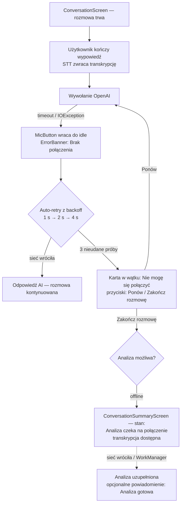

- **Kluczowa zasada (offline-first):** wypowiedź użytkownika **nigdy nie ginie** —
  transkrypcja jest w Room zanim ruszy request; retry wysyła tę samą wiadomość.
- STT (`SpeechRecognizer` on-device) i TTS działają offline — zawodzi tylko warstwa AI.
- Analiza po rozmowie kolejkowana przez WorkManager (constraint `NetworkType.CONNECTED`);
  podsumowanie pokazuje transkrypcję od razu, sekcje AI (błędy, feedback) w stanie
  „oczekuje na połączenie".
- **Edge case — brak sieci przy próbie startu rozmowy:** CTA na Home/Rozmowach pokazuje
  od razu komunikat „Rozmowa wymaga internetu" (bez wchodzenia na ekran); dostępne
  offline pozostają: historia, ćwiczenia, fiszki, notatki, statystyki.

---

## F5. Przerwana rozmowa (telefon dzwoni / aplikacja w tle)

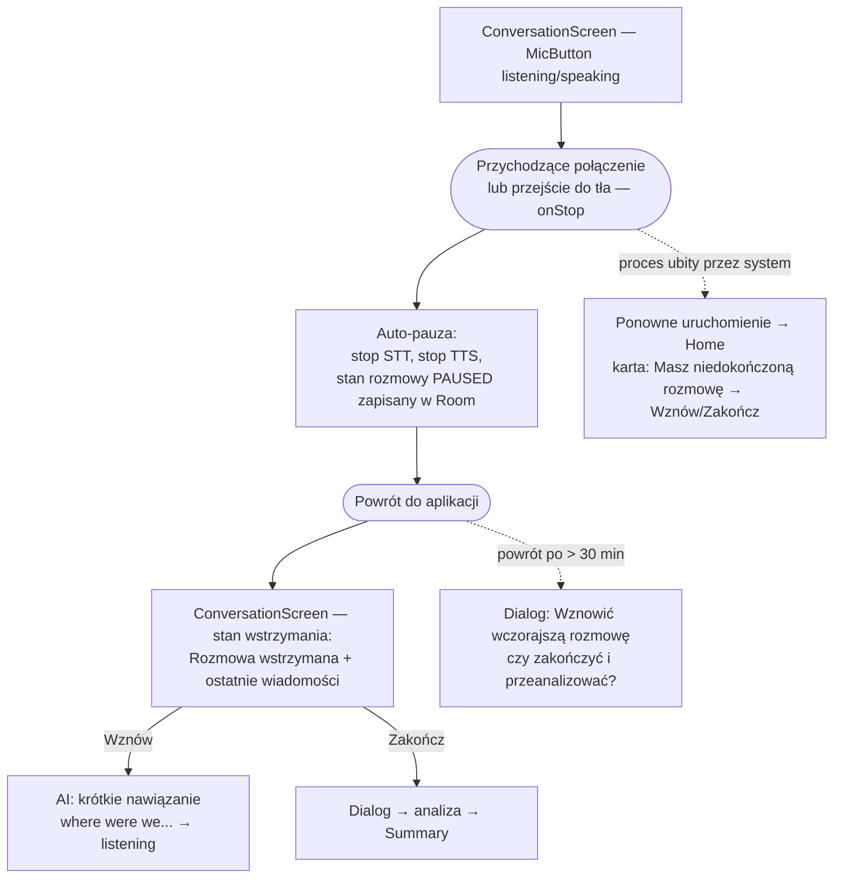

- **Happy path:** pauza automatyczna i bezstratna — audio focus oddany (`AudioFocusRequest`),
  częściowa transkrypcja z aktywnego nasłuchu odrzucana (użytkownik powtórzy myśl),
  wszystkie zakończone wiadomości są już w Room.
- **Edge case — długa przerwa (> 30 min):** przy powrocie dialog wyboru: wznowienie
  (AI dostaje kontekst z historii) albo zakończenie z analizą.
- **Edge case — process death:** rozmowa ze statusem innym niż zakończona wykrywana
  przy starcie; Home pokazuje kartę wznowienia. Rozmowy porzucone > 24 h są
  automatycznie zamykane i analizowane w tle.

---

## F6. Powtórka z powiadomienia (deep link)

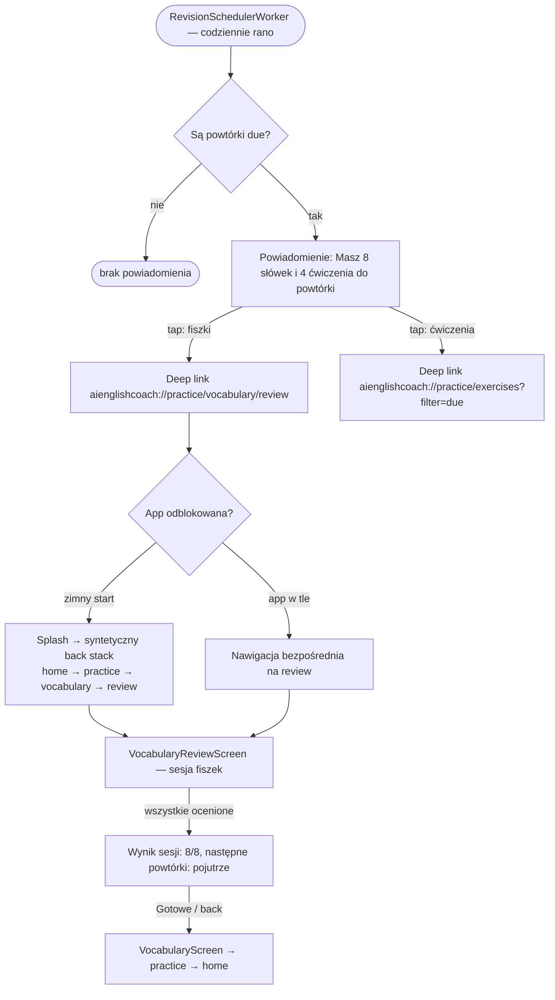

- **Happy path:** tap w powiadomienie → sesja fiszek w < 2 s; po sesji back prowadzi
  w głąb aplikacji (syntetyczny stack), nie na launcher — naturalna okazja do
  kontynuowania nauki.
- **Edge case — powtórki zrobione wcześniej w aplikacji:** deep link trafia na
  VocabularyReviewScreen w stanie pustym „Wszystko powtórzone ✓" z CTA „Wróć do nauki".
- **Edge case — onboarding nieukończony:** deep link ignorowany, start od splash → onboarding.
- **Edge case — brak zgody na powiadomienia:** worker działa (wyznacza due), ale nie
  powiadamia; powtórki widoczne na Home i w badge zakładki Nauka.

---

## F7. Dodanie słówka ręcznie

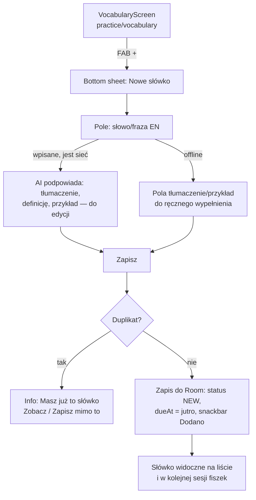

- **Happy path:** wpisanie słowa → autouzupełnienie AI (debounce ~600 ms) → korekta →
  zapis; słówko wchodzi w cykl SRS od następnego dnia.
- **Edge case — offline:** formularz w pełni ręczny (zapis lokalny działa zawsze);
  brak kolejkowania wzbogacania AI w MVP — użytkownik może później edytować wpis.
- **Edge case — duplikat:** łagodne ostrzeżenie z podglądem istniejącego wpisu.
- **Drugi punkt wejścia:** long-press słowa w `MessageBubble` podczas rozmowy /
  w podsumowaniu → „Zapisz słówko" → ten sam bottom sheet z prewypełnionym słowem
  i `sourceConversationId`.

---

## F8. Trening wymowy

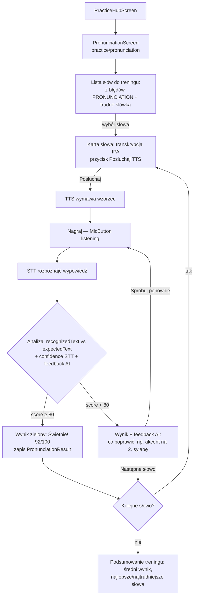

- **Happy path:** pętla posłuchaj → nagraj → wynik; wyniki zapisywane do
  `pronunciation_results`, średnia zasila `daily_stats.pronunciationAvg`.
- **Edge case — STT nic nie rozpoznał (cisza/szum):** komunikat „Nie usłyszałem —
  spróbuj bliżej mikrofonu", bez zapisu wyniku, bez naliczenia próby.
- **Edge case — offline:** odsłuch TTS i rozpoznanie STT działają (on-device),
  wynik liczony lokalnie z porównania tekstów i confidence; tekstowy feedback AI
  oznaczony „dostępny online" i pomijany.
- **Edge case — brak uprawnienia do mikrofonu:** przycisk Nagraj uruchamia przepływ F3.

---

## F9. Nagranie notatki głosowej

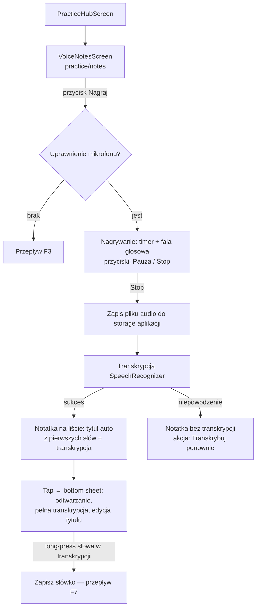

- **Happy path:** nagranie → automatyczna transkrypcja → notatka z tytułem i tekstem;
  wszystko działa w pełni offline.
- **Edge case — bardzo długie nagranie:** miękki limit 5 min z ostrzeżeniem przy 4:30;
  po limicie auto-stop i zapis.
- **Edge case — przerwanie (telefon):** nagrywanie zatrzymane, dotychczasowy materiał
  zapisany jako notatka (nic nie ginie).
- **Prywatność (zgodnie z briefem):** w rozmowach audio jest kasowane po transkrypcji;
  notatki głosowe to świadomy wyjątek — plik audio pozostaje, bo odtwarzanie jest
  funkcją notatki. Kasowanie notatki usuwa plik.

---

## F10. Zmiana poziomu w ustawieniach

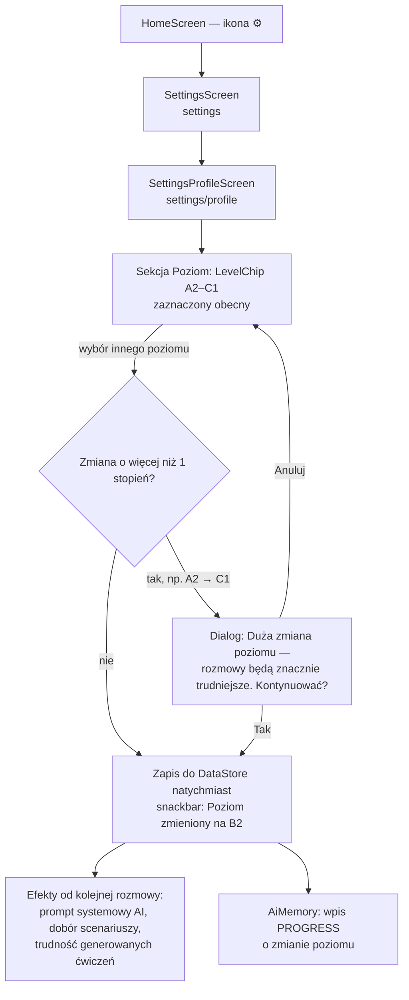

- **Happy path:** zmiana o jeden stopień bez tarcia, zapis natychmiastowy (brak
  przycisku „Zapisz" — wzorzec ustawień Android).
- **Edge case — skrajna zmiana:** dialog ostrzegawczy zapobiega przypadkowej frustracji.
- Zmiana **nie modyfikuje wstecz** danych historycznych (statystyki, `dueAt` powtórek
  pozostają); wpływa tylko na przyszłe treści AI.
- Na tym samym ekranie analogicznie edytowalne są cele nauki i cel dzienny.

---

## F11. Wyczerpanie limitu API (429 / brak środków)

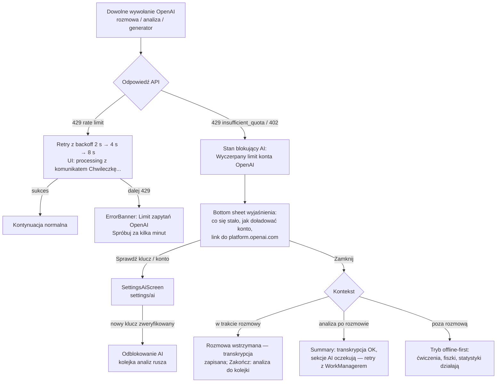

- **Kluczowa zasada:** wyczerpanie limitu **degraduje, nie zabija** aplikację —
  wszystko poza wywołaniami AI działa (Room jest źródłem prawdy).
- Rozróżnienie błędów: chwilowy rate limit (auto-retry, banner informacyjny) vs
  wyczerpana kwota (stan trwały do interwencji użytkownika, bottom sheet z wyjaśnieniem).
- Zaległe analizy rozmów czekają w kolejce WorkManagera i wykonują się po naprawie.
- Na Home utrzymuje się banner „Funkcje AI wstrzymane — [Sprawdź ustawienia]"
  dopóki pierwszy request po zmianie klucza się nie powiedzie.

---

## F12. Mapa pokrycia przepływów

| Przepływ | Ekrany kluczowe | Moduły (brief §2) |
|---|---|---|
| F1 główny | splash → onboarding/* → home → conversation → summary → exercises → review → statistics | wszystkie |
| F2 powracający | splash, home, conversation, review | conversation, revision, statistics |
| F3 mikrofon | onboarding/permissions, conversation | conversation, pronunciation, voicenotes |
| F4 offline w rozmowie | conversation, summary | conversation, ai, sync |
| F5 przerwana rozmowa | conversation, home | conversation, audio |
| F6 powtórka z powiadomienia | review, exercises (deep link) | revision, vocabulary, exercises |
| F7 słówko ręcznie | vocabulary (+ MessageBubble) | vocabulary, ai |
| F8 wymowa | pronunciation | pronunciation, audio, ai |
| F9 notatka głosowa | notes | voicenotes, audio |
| F10 zmiana poziomu | settings/profile | settings, memory, ai |
| F11 limit API | conversation, summary, settings/ai | ai, settings |
