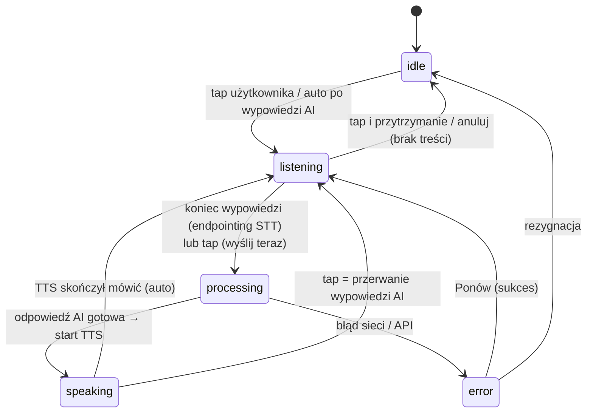

# ETAP 6 — UX (zachowania ekranów, motion, stany, dostępność)

> Dokument bazuje na [00-brief-decyzje-projektowe.md](./00-brief-decyzje-projektowe.md),
> [04-architektura-informacji.md](./04-architektura-informacji.md) oraz
> [05-user-flow.md](./05-user-flow.md). Komponenty (`MicButton`, `MessageBubble`,
> `ErrorBanner`, `EmptyState`, `StatTile`, `ProgressRing`...) — kanoniczne z briefu §10.

## 1. Zachowanie kluczowych ekranów

### 1.1. ConversationScreen (`conversation/{id}`) — serce produktu

Layout: top bar (scenariusz + timer, ✕, ikona ⌨), wątek `MessageBubble`
(auto-scroll do najnowszej), na dole strefa głosowa: live transkrypcja + `MicButton`.

**Maszyna stanów MicButton:**

| Stan | Wygląd MicButton | Zachowanie | Komunikacja |
|---|---|---|---|
| `idle` | koło primary (#4F46E5), ikona mikrofonu, spoczynek | czeka na tap | podpis „Dotknij, aby mówić"; contentDescription: „Rozpocznij mówienie" |
| `listening` | powiększony ×1.15, pierścień fali reagujący na amplitudę (RMS z mikrofonu), kolor secondary (teal) | STT aktywny; live transkrypcja nad przyciskiem; endpointing ~1,5–2 s ciszy kończy wypowiedź; tap = wyślij od razu | podpis „Słucham…"; haptic `CONFIRM` przy wejściu w stan |
| `processing` | ikona zamienia się w trójkropkowy wskaźnik, pierścień obraca się (indeterminate), lekko przygaszony | request do OpenAI; > 4 s → dopisek „Chwileczkę…"; tap nieaktywny (poza anulowaniem długiego oczekiwania > 10 s) | bąbelek użytkownika już w wątku (optimistic — jest w Room) |
| `speaking` | ikona głośnika, fala pulsuje w rytmie syntezy, kolor tertiary (bursztyn) | TTS czyta odpowiedź; tekst AI podświetlany fraza po frazie; **tap = przerwanie** | podpis „Dotknij, aby przerwać i mówić" |
| `error` (wariant idle) | koło z obrysem error (#DC2626), ikona ⚠ | pokazany `ErrorBanner` + akcja Ponów | patrz §4 dialog wyjaśnienia błędu |

**Live transkrypcja:** częściowe wyniki STT renderowane nad MicButton w kolorze
`onSurfaceVariant` (tekst „niepewny"); po zakończeniu wypowiedzi tekst finalny
przenosi się animacją do wątku jako `MessageBubble` użytkownika. Użytkownik może
tapnąć transkrypcję częściową, by ją skorygować w trybie pisania przed wysłaniem.

**Przerwanie wypowiedzi AI (barge-in):** tap w MicButton (lub w dowolne miejsce
strefy głosowej) podczas `speaking` → TTS stop w < 100 ms, tekst niewypowiedziany
pozostaje w bąbelku (całość i tak jest w wątku), natychmiastowe przejście do
`listening` z hapticiem. To kluczowe dla naturalności — użytkownik nie może czekać,
aż AI skończy monolog.

**Timer i cel dzienny:** timer sesji w top barze; po osiągnięciu celu dziennego
dyskretny wskaźnik ✓ przy timerze (bez przerywania rozmowy).

**Tryb pisania:** ikona ⌨ w top barze przełącza strefę głosową na pole tekstowe
z przyciskiem wyślij; odpowiedzi AI nadal czytane TTS (wyłączalne). Patrz §7.

### 1.2. HomeScreen (`home`)

- Kolejność sekcji dynamiczna wg priorytetu dnia: (1) hero CTA „Rozpocznij rozmowę"
  z sugerowanym scenariuszem, (2) `ProgressRing` celu dziennego + streak (płomień
  i licznik dni), (3) karta powtórek due (liczba słówek + ćwiczeń, CTA „Powtórz teraz"),
  (4) skrót ostatniego podsumowania rozmowy.
- Streak zagrożony (wieczór, cel 0 min) → karta zmienia ton na motywujący
  (kolor tertiary), nigdy karcący.
- Bannery systemowe (błąd klucza API, offline) nad sekcjami — patrz §4 i §8.

### 1.3. ConversationListScreen (`conversations`)

- Lista odwrotnie chronologiczna: tytuł, scenariusz, data, czas trwania, mini-wskaźnik
  liczby błędów; rozmowa w toku (PAUSED) przypięta na górze z etykietą „Wznów".
- Tap: zakończona → Summary; w toku → ConversationScreen. FAB „Nowa rozmowa" →
  bottom sheet scenariuszy (small talk, praca, podróże, wolny temat + poziom trudności).
- Usuwanie: long-press → menu → dialog potwierdzenia (patrz §4).

### 1.4. ConversationSummaryScreen (`conversation/{id}/summary`)

- Sekcje w kolejności: ocena ogólna + 2–3 zdania feedbacku AI → błędy pogrupowane
  wg kategorii (GRAMMAR/VOCABULARY/PRONUNCIATION/FLUENCY; każdy błąd: oryginał
  przekreślony, poprawka wyróżniona, wyjaśnienie po polsku, rozwijane) →
  nowe słówka (chipy, tap = szczegół, przycisk „Dodaj wszystkie do fiszek") →
  pełna transkrypcja (zwijana) → CTA: [Ćwicz błędy] / [Zobacz słówka].
- Analiza w toku: sekcje AI jako skeleton z podpisem „Analizuję rozmowę…";
  transkrypcja dostępna natychmiast (jest w Room).

### 1.5. ExercisePlayerScreen (`practice/exercises/session`)

- Jedna karta ćwiczenia na ekran; pasek postępu „3/10" w top barze.
- Odpowiedź → natychmiastowy feedback: zielone podświetlenie / czerwone z poprawną
  odpowiedzią i wyjaśnieniem; przycisk [Dalej] (bez auto-przejścia — użytkownik
  kontroluje tempo czytania wyjaśnień).
- SPEAKING: wariant z MicButton (stany jak w rozmowie, bez wywołania chat AI —
  porównanie STT z oczekiwaną odpowiedzią).
- Wynik sesji: X/Y, wpływ na harmonogram („kolejna powtórka: za 6 dni"), CTA [Gotowe].

### 1.6. VocabularyReviewScreen (`practice/vocabulary/review`)

- Fiszka: przód EN (tap lub swipe w górę = odwrócenie z animacją flip 3D),
  tył: tłumaczenie + definicja + przykład + przycisk odsłuchu TTS.
- Samoocena SM-2 zredukowana do 3 przycisków: [Nie wiem] (0–2) / [Trudne] (3) /
  [Umiem] (4–5) — mapowanie na skalę 0–5 pod spodem; swipe jako skrót (patrz §5).
- Licznik pozostałych kart; sesja przerywalna (postęp ocenionych kart zapisany).

### 1.7. PronunciationScreen (`practice/pronunciation`)

- Karta słowa: słowo dużym drukiem + IPA + [Posłuchaj] (TTS, wolniejsze tempo
  dostępne long-pressem) + [Nagraj].
- Wynik: liczba 0–100 na `ProgressRing` (kolor: <60 error, 60–79 tertiary,
  ≥80 secondary) + porównanie „usłyszałem: …" + feedback AI (online).
- Historia prób słowa jako sparkline pod kartą.

### 1.8. StatisticsScreen (`statistics`)

- Rząd `StatTile`: streak, minuty łącznie, słówka opanowane, skuteczność ćwiczeń.
- Wykresy (zakres 7/30 dni): minuty rozmów (słupkowy), nowe słówka (liniowy),
  wymowa średnia (liniowy). Raport tygodniowy AI jako karta tekstowa (generowany
  w niedzielę, offline pokazywany ostatni zapisany).

### 1.9. Ustawienia (`settings`, `settings/ai`, `settings/profile`, `settings/data`)

- Zmiany zapisywane natychmiast (DataStore), potwierdzane snackbar.
- `settings/ai`: klucz maskowany (`sk-…3f9A`), [Zmień] → pole + walidacja online;
  wybór modelu (lista z opisem kosztów); głos TTS US/GB z przyciskiem odsłuchu
  próbki; slider tempa mowy (0.75×–1.25×).
- `settings/data`: [Eksportuj dane (JSON)] → systemowy picker zapisu;
  [Usuń wszystkie dane] → dialog destrukcyjny (patrz §4) → reset do onboardingu.

## 2. Animacje i motion

Zasady globalne (M3 motion, brief §10): emphasized easing, czasy 200–400 ms,
wszystkie animacje respektują systemowe `Ustawienia > Usuń animacje`
(`LocalAccessibilityManager` / skala animatora = 0 → przejścia natychmiastowe).

| Element | Animacja | Spec |
|---|---|---|
| Fala głosowa (`listening`) | pierścień wokół MicButton skalowany amplitudą RMS + 3 koncentryczne okręgi rozchodzące się co 1,2 s | `animateFloatAsState` sterowany strumieniem amplitudy (throttle 50 ms); spring `Spring.DampingRatioLowBouncy` |
| MicButton zmiana stanu | crossfade ikony 150 ms + skala 1.0→1.15 (listening) | `AnimatedContent` + `animateDpAsState`, emphasized decelerate |
| Fala podczas `speaking` | pulsowanie sinusoidalne pierścienia (niezależne od mikrofonu) | `rememberInfiniteTransition`, okres 900 ms |
| Przejścia ekranów (push) | wejście: slide-in 30% od prawej + fade; wyjście: fade | 300 ms emphasized; powrót lustrzany |
| Zmiana zakładki bottom nav | fade-through (M3): stary fade-out 90 ms → nowy fade-in 210 ms | bez slide — zakładki są równorzędne |
| Wejście na ConversationScreen | container transform z hero CTA (Home) / elementu listy | 400 ms, arc motion |
| Nowa wiadomość w wątku | slide-in-bottom + fade 250 ms; auto-scroll `animateScrollToItem` | stagger 50 ms gdy wchodzi kilka |
| Transkrypcja live → bąbelek | tekst „przelatuje" do pozycji bąbelka (shared bounds) | 300 ms |
| Flip fiszki | rotacja Y 0→180°, camera distance 12f | 350 ms emphasized |
| Swipe fiszki | translacja + rotacja ±8° + tint zieleń/czerwień wg kierunku | threshold 35% szerokości; spring przy powrocie |
| ProgressRing (cel dzienny) | animacja przyrostu łuku przy każdym wejściu na Home | 600 ms, decelerate; przy 100% jednorazowy „burst" konfetti (wyłączalny) |
| Skeleton loading | shimmer: gradient przesuwany po placeholderach kart | okres 1,1 s, tylko w stanach loading > 300 ms (unikamy mignięcia) |
| Streak +1 | licznik płomienia: scale bounce + odliczenie liczby | 500 ms; haptic `CONFIRM` |
| ErrorBanner | slide-in z góry + auto-dismiss (informacyjne) lub trwały (blokujące) | 250 ms |

## 3. Stany loading / empty / error (wszystkie ekrany)

Komponenty kanoniczne: `LoadingIndicator` (pełnoekranowy tylko gdy brak żadnych
danych; poza tym skeleton lub wskaźnik sekcji), `EmptyState` (ilustracja + nagłówek
+ 1 zdanie + CTA), `ErrorBanner` (nieblokujący) / karta błędu z [Ponów] (blokujący).
Reguła: dane z Room pokazujemy **zawsze natychmiast** — loading dotyczy głównie warstwy AI.

| Ekran | Loading | Empty | Error |
|---|---|---|---|
| SplashScreen | logo + wskaźnik (tylko > 500 ms) | n/d | błąd odczytu DataStore → przejście do onboardingu (fail-safe) |
| WelcomeScreen / LevelSelectionScreen / GoalsScreen / PermissionsScreen | n/d (treść statyczna) | n/d | n/d |
| ApiSetupScreen | przycisk [Zweryfikuj] → wskaźnik w przycisku, pola zablokowane | n/d | inline pod polem: 401 „Klucz nieprawidłowy"; sieć: „Sprawdź połączenie"; [Spróbuj ponownie] |
| HomeScreen | skeleton kart (pierwsze otwarcie dnia, < 1 s) | stan zerowy = onboarding treściowy: „Zacznij pierwszą rozmowę" | banner klucza API / offline; sekcje zawsze z lokalnych danych |
| ConversationListScreen | skeleton 3 wierszy | EmptyState: „Brak rozmów — czas na pierwszą!" + CTA | błędy tylko przy akcjach (usuwanie) → snackbar z [Ponów] |
| ConversationScreen | `processing` na MicButton; start rozmowy: „Łączę z tutorem…" na strefie głosowej | nowa rozmowa: AI otwiera pierwszą wiadomością (brak pustego stanu) | karta błędu w wątku: [Ponów] / [Zakończ]; szczegóły → bottom sheet (§4); offline → banner + F4 |
| ConversationSummaryScreen | skeleton sekcji AI + „Analizuję rozmowę…"; transkrypcja od razu | rozmowa bez wypowiedzi użytkownika: „Za krótko na analizę" + transkrypcja | „Analiza nie powiodła się" + [Ponów analizę]; kolejka WorkManager gdy offline |
| PracticeHubScreen | liczniki due jako skeleton chips | n/d (hub zawsze ma kafle) | n/d (dane lokalne) |
| ExercisesScreen | skeleton listy | EmptyState: „Brak ćwiczeń — pojawią się po rozmowie z błędami" + CTA „Rozpocznij rozmowę"; wariant „Wszystko powtórzone ✓" dla filtra due | generowanie ćwiczeń (online) nieudane → banner + [Ponów] |
| ExercisePlayerScreen | przejście między kartami < 100 ms (dane prefetch) | n/d (wejście tylko gdy są ćwiczenia) | błąd zapisu oceny → snackbar, ocena ponawiana lokalnie |
| VocabularyScreen | skeleton listy | EmptyState: „Słówka pojawią się z rozmów — albo dodaj pierwsze ręcznie" + CTA „+" | wzbogacanie AI nieudane → formularz ręczny (F7) |
| VocabularyReviewScreen | n/d (karty lokalne) | „Wszystko powtórzone ✓ Wróć jutro" + CTA „Wróć do nauki" | błąd zapisu oceny → snackbar z [Ponów] |
| PronunciationScreen | analiza próbki: wskaźnik na karcie wyniku | „Brak słów do treningu — pojawią się z rozmów" | STT bez wyniku: „Nie usłyszałem — spróbuj ponownie"; feedback AI offline → sekcja oznaczona „dostępne online" |
| VoiceNotesScreen | transkrypcja w toku: wskaźnik na kafelku notatki | EmptyState: „Nagraj pierwszą notatkę" + strzałka do przycisku | transkrypcja nieudana → etykieta + akcja [Transkrybuj ponownie]; audio zawsze zapisane |
| StatisticsScreen | skeleton kafli i wykresów (< 500 ms, agregacja Room) | „Statystyki pojawią się po pierwszej rozmowie" + CTA | raport tygodniowy AI nieudany → ostatni zapisany + dopisek daty |
| SettingsScreen / SettingsProfileScreen | n/d (DataStore synchronny w praktyce) | n/d | n/d |
| SettingsAiScreen | walidacja klucza / odsłuch próbki TTS → wskaźnik przy akcji | n/d | walidacja: inline error jak w ApiSetupScreen |
| SettingsDataScreen | eksport: wskaźnik + blokada przycisku | n/d | eksport nieudany → snackbar z [Ponów]; kasowanie nieudane → dialog błędu (bez częściowego kasowania — transakcja) |

## 4. Dialogi i bottom sheets

Reguły: dialog (`AlertDialog`) = decyzja blokująca, max 2 zdania + 2–3 akcje;
bottom sheet = treść bogatsza / formularze / wyjaśnienia. Akcja destrukcyjna zawsze
w kolorze error i nigdy jako domyślna. Wszystkie arkusze zamykane swipe-down i scrimem.

| # | Element | Typ | Wywołanie | Treść i akcje |
|---|---|---|---|---|
| D1 | Zakończenie rozmowy | dialog | ✕ lub back na ConversationScreen | „Zakończyć rozmowę?" + czas i liczba wypowiedzi · [Zakończ i analizuj] (primary) · [Odrzuć rozmowę] (error, tylko gdy < 2 wypowiedzi użytkownika) · [Wróć do rozmowy] |
| D2 | Przerwanie sesji ćwiczeń/fiszek | dialog | ✕ lub back w ExercisePlayerScreen / VocabularyReviewScreen | „Przerwać sesję? Ocenione odpowiedzi zostaną zapisane." · [Przerwij] · [Kontynuuj] |
| D3 | Usunięcie rozmowy / notatki / słówka | dialog | menu long-press | „Usunąć na stałe? Tej operacji nie można cofnąć." · [Usuń] (error) · [Anuluj]; po usunięciu snackbar z [Cofnij] (5 s, soft delete) |
| D4 | Kasowanie wszystkich danych | dialog dwustopniowy | SettingsDataScreen | krok 1: lista co zniknie (rozmowy, słówka, statystyki, pamięć AI); krok 2: pole „wpisz USUŃ" · [Usuń wszystko] (error) · [Anuluj] |
| D5 | Wyjaśnienie błędu w rozmowie | bottom sheet | tap „Szczegóły" na karcie błędu / ErrorBanner | ludzkie wyjaśnienie przyczyny (offline / limit / klucz / serwer OpenAI), co zrobiło się automatycznie (retry, zapis lokalny), akcje kontekstowe: [Ponów] / [Ustawienia AI] / [Zakończ rozmowę] |
| D6 | Wybór scenariusza rozmowy | bottom sheet | FAB w ConversationListScreen / hero CTA Home (long-press) | siatka scenariuszy + „wolny temat"; chip poziomu trudności |
| D7 | Dodanie/edycja słówka | bottom sheet | FAB „+" w VocabularyScreen; long-press słowa w MessageBubble | formularz F7: słowo, tłumaczenie, definicja, przykład (auto-podpowiedzi AI) · [Zapisz] |
| D8 | Szczegół słówka | bottom sheet | tap chipu słówka (Summary/Vocabulary) | słowo + IPA + odsłuch TTS + tłumaczenie + przykład + status SRS + [Dodaj do fiszek]/[Edytuj] |
| D9 | Szczegół notatki głosowej | bottom sheet | tap notatki w VoiceNotesScreen | odtwarzacz (scrub, prędkość), transkrypcja (long-press słowa → D7), edycja tytułu |
| D10 | Wyczerpany limit API | bottom sheet | błąd quota (F11) | wyjaśnienie + link do platform.openai.com + [Ustawienia AI] + [Zamknij] |
| D11 | Duża zmiana poziomu | dialog | SettingsProfileScreen (F10) | ostrzeżenie o skoku trudności · [Zmień] · [Anuluj] |
| D12 | Wznowienie przerwanej rozmowy | dialog | powrót po > 30 min / karta na Home (F5) | „Masz niedokończoną rozmowę (wczoraj, 4 min)." · [Wznów] · [Zakończ i analizuj] |
| D13 | Menu kontekstowe wiadomości | menu (dropdown przy bąbelku) | long-press MessageBubble | Przetłumacz · Zapisz słówko · Odtwórz ponownie · Kopiuj |

## 5. Gesty

| Gest | Miejsce | Efekt | Uwagi |
|---|---|---|---|
| Swipe fiszki w prawo | VocabularyReviewScreen | ocena [Umiem] | tint secondary + ikona ✓ podczas przeciągania; threshold 35% szerokości |
| Swipe fiszki w lewo | VocabularyReviewScreen | ocena [Nie wiem] | tint error + ikona ✕ |
| Swipe fiszki w górę / tap | VocabularyReviewScreen | odwrócenie karty | flip 3D |
| Pull-to-refresh | ConversationListScreen, VocabularyScreen, ExercisesScreen, StatisticsScreen | ponowne przeliczenie due / odświeżenie agregatów; na Summary: retry zaległej analizy | dane są lokalne — gest głównie dla oczekiwań użytkowników; wskaźnik M3 `PullToRefreshBox` |
| Long-press MessageBubble | ConversationScreen, ConversationSummaryScreen | menu D13: Przetłumacz (tłumaczenie inline pod bąbelkiem, cache w `messages.translation`) / Zapisz słówko (D7 z prewypełnieniem) / Odtwórz / Kopiuj | haptic `LONG_PRESS`; zaznaczenie pojedynczego słowa long-pressem na tekście → od razu D7 |
| Long-press pozycji list | ConversationListScreen, VocabularyScreen, VoiceNotesScreen | menu kontekstowe (IA §3.3) | |
| Swipe-to-dismiss pozycji | VoiceNotesScreen, VocabularyScreen | usunięcie z tłem error i ikoną kosza | zawsze ze snackbar [Cofnij] |
| Tap podczas `speaking` | ConversationScreen (strefa głosowa) | przerwanie AI (barge-in) | patrz §1.1 |
| Long-press [Posłuchaj] | PronunciationScreen, D8 | odtworzenie w zwolnionym tempie (0.7×) | wskazówka przy pierwszym użyciu |
| Swipe-down | wszystkie bottom sheets | zamknięcie | standard M3 |

Każdy gest ma **jawną alternatywę dotykową** (przyciski ocen pod fiszką, menu z ikony
⋮ tam, gdzie long-press) — gesty są akceleratorem, nie jedyną drogą (dostępność §7).

## 6. Haptyka i dźwięk

- Haptic: wejście w `listening` (`CONFIRM`), błąd (`REJECT`), long-press
  (`LONG_PRESS`), poprawna/niepoprawna odpowiedź w ćwiczeniach (tick / double-tick),
  ukończenie sesji (`CONFIRM`).
- Dyskretne earcony (opcjonalne, wyłączane w ustawieniach): start/stop nasłuchu —
  ważne, bo użytkownik często nie patrzy na ekran podczas mówienia.

## 7. Dostępność

- **TalkBack:**
  - MicButton: `contentDescription` zmienny wg stanu („Rozpocznij mówienie" /
    „Słucham, dotknij dwukrotnie aby wysłać" / „Przetwarzam odpowiedź" /
    „Tutor mówi, dotknij dwukrotnie aby przerwać"); zmiany stanu ogłaszane
    `liveRegion = polite`.
  - Nowe wiadomości AI ogłaszane (gdy TTS wyciszony); wynik ćwiczenia i wyniki
    wymowy jako `announcement`.
  - Elementy dekoracyjne (fala, konfetti, ilustracje EmptyState) →
    `invisibleToUser` / brak semantyki.
  - Akcje z gestów wystawione jako `customActions` (fiszka: „oceń jako umiem",
    „oceń jako nie wiem"; wiadomość: „przetłumacz", „zapisz słówko").
  - Kolejność fokusu jawna na ekranach złożonych (Summary: ocena → błędy → słówka →
    transkrypcja → CTA); dialogi przechwytują fokus.
- **Dynamiczne czcionki:** pełne wsparcie skali systemowej do 200%; wyłącznie `sp`
  dla tekstu; layouty odporne (teksty wielolinijkowe, brak stałych wysokości wierszy);
  przy skali ≥ 150% rząd `StatTile` przechodzi w układ 2×2, chipy słówek zawijają się.
- **Kontrast AA:** wszystkie pary tekst/tło ≥ 4,5:1 (duży tekst ≥ 3:1) w light
  i dark; stany błędów nie polegają wyłącznie na kolorze (ikona + tekst);
  wyniki wymowy: kolor + liczba + etykieta słowna.
- **Touch targets:** minimum 48×48 dp (brief §12): MicButton 96 dp, przyciski ocen
  fiszek 56 dp, ikony top baru 48 dp, chipy z paddingiem dobijającym do 48 dp
  w osi dotyku; odstęp min 8 dp między celami.
- **Alternatywa tekstowa dla rozmowy głosowej — tryb pisania:**
  - przełącznik ⌨ w top barze ConversationScreen; strefa głosowa zamienia się
    w pole tekstowe + [Wyślij]; pełna rozmowa możliwa bez mikrofonu i bez słuchania
    (TTS wyłączalny niezależnie);
  - tryb zapamiętywany per użytkownik (DataStore); proponowany automatycznie przy
    trwałej odmowie mikrofonu (F3) i po wykryciu włączonego TalkBack (podpowiedź,
    nie wymuszenie);
  - ćwiczenia SPEAKING mają wariant „wpisz odpowiedź"; PronunciationScreen jako
    jedyny wymaga mikrofonu (istota funkcji) — komunikuje to jasno.
- **Redukcja ruchu:** przy systemowym wyłączeniu animacji fala zastąpiona statycznym
  pierścieniem ze zmianą koloru, konfetti wyłączone, przejścia natychmiastowe.

## 8. Tryb offline

Zasada z briefu: **Room = źródło prawdy; sieć potrzebna tylko do wywołań AI.**

### 8.1. Co działa offline (pełna funkcjonalność)

- historia rozmów i transkrypcje (odczyt), zapisane podsumowania;
- ćwiczenia już wygenerowane: sesje, oceny, SM-2;
- fiszki słownictwa: przegląd, oceny, dodawanie/edycja ręczna (bez podpowiedzi AI);
- trening wymowy w wariancie lokalnym (STT on-device + porównanie tekstów; bez
  feedbacku tekstowego AI);
- notatki głosowe: nagrywanie, transkrypcja (on-device), odtwarzanie, lista;
- statystyki i wykresy (agregaty lokalne), ostatni zapisany raport tygodniowy;
- ustawienia (poza walidacją klucza online), eksport JSON.

### 8.2. Co jest zablokowane offline

| Funkcja | Zachowanie UI |
|---|---|
| nowa rozmowa głosowa / kontynuacja z odpowiedzią AI | CTA aktywne wizualnie, po tapnięciu snackbar „Rozmowa wymaga internetu"; podczas rozmowy — przepływ F4 |
| analiza po rozmowie | sekcje Summary w stanie „Oczekuje na połączenie" + ikona kolejki |
| generowanie nowych ćwiczeń | ExercisesScreen: banner „Nowe ćwiczenia po odzyskaniu połączenia" |
| podpowiedzi AI przy dodawaniu słówka | pola ręczne (F7) |
| tłumaczenie wiadomości (long-press) | pozycja menu przygaszona z dopiskiem „offline"; jeśli tłumaczenie w cache (`messages.translation`) — działa |
| feedback AI wymowy | sekcja oznaczona „dostępne online" |
| walidacja klucza API | przycisk nieaktywny + wyjaśnienie |

### 8.3. Banery informacyjne

- Globalny, dyskretny banner offline (`ErrorBanner` w wariancie informacyjnym,
  kolor `surfaceVariant`, ikona chmury przekreślonej): „Jesteś offline — nauka
  działa, rozmowy AI wstrzymane". Pokazywany **tylko** na ekranach, których to
  dotyczy (Home, Rozmowy, ConversationScreen, Summary z zaległą analizą); nie na
  fiszkach/notatkach, gdzie offline niczego nie zmienia.
- Powrót sieci: banner zmienia się na 3 s w „Połączono ✓ — wznawiam zaległe zadania"
  i znika.

### 8.4. Kolejkowanie (WorkManager, constraint `NetworkType.CONNECTED`)

| Zadanie | Kiedy trafia do kolejki | Po odzyskaniu sieci |
|---|---|---|
| analiza rozmowy (błędy, słówka, feedback) | zakończenie rozmowy offline / błąd API | wykonanie + uzupełnienie Summary; opcjonalne powiadomienie „Analiza gotowa" (deep link IA §4.5) |
| `MemoryConsolidationWorker` | zawsze po rozmowie (retry z backoff) | konsolidacja pamięci + embeddingi |
| generowanie ćwiczeń z nowych błędów | po udanej analizie | ćwiczenia pojawiają się na liście + badge Nauka |
| wzbogacenie raportu tygodniowego | niedziela bez sieci | generacja przy pierwszym połączeniu |

Reguły kolejki: zadania idempotentne (klucz = `conversationId`), unikatowe
(`ExistingWorkPolicy.KEEP`), backoff wykładniczy od 30 s; użytkownik widzi stan
kolejki tylko przez stany sekcji („oczekuje na połączenie") — bez osobnego ekranu
zarządzania kolejką (zbędna złożoność dla MVP).
