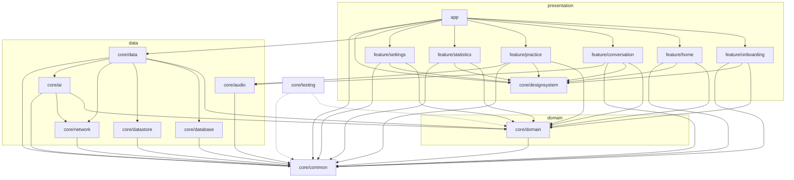
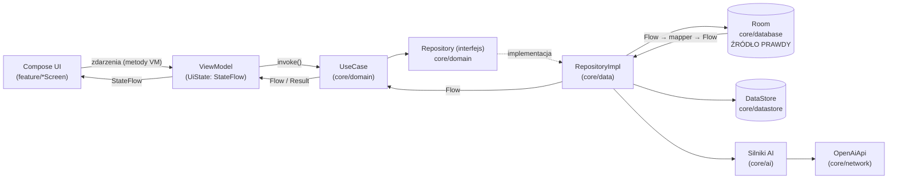

# ETAP 9 — Architektura techniczna

> Dokument zgodny z kanonicznym briefem: [00-brief-decyzje-projektowe.md](00-brief-decyzje-projektowe.md).
> Pakiet bazowy: `com.aienglishcoach`. Wszystkie nazwy modułów, tabel i ekranów pochodzą z briefu.

## 1. Przegląd

AI English Coach jest natywną aplikacją Android zbudowaną w oparciu o:

- **Clean Architecture** — trzy warstwy (presentation / domain / data) z jednokierunkową regułą zależności,
- **MVVM z unidirectional data flow (UDF)** — `UiState` przez `StateFlow`, zdarzenia jako metody ViewModelu, efekty jednorazowe,
- **Repository Pattern** — interfejsy w `core/domain`, implementacje w `core/data`,
- **Use Cases** — pojedyncza odpowiedzialność, konwencja `operator fun invoke`,
- **Hilt** — dependency injection z modułami per warstwa,
- **Offline-First** — Room jako jedyne źródło prawdy (source of truth),
- **architekturę wielomodułową Gradle** — wzorzec Now in Android (build-logic convention plugins + version catalog).

## 2. Clean Architecture — warstwy i reguła zależności

### 2.1 Warstwy

| Warstwa | Moduły Gradle | Zawartość | Zależności technologiczne |
|---|---|---|---|
| **Presentation** | `app`, `feature/*`, `core/designsystem` | Compose UI, ViewModele, `UiState`, nawigacja | Compose, Navigation, Hilt, Lifecycle |
| **Domain** | `core/domain` | modele domenowe (`Conversation`, `Message`, `UserError`, `VocabularyItem`, `Exercise`, `PronunciationResult`, `VoiceNote`, `DailyStats`, `AiMemory`, `UserPreferences`), interfejsy repozytoriów, use case'y | **czysty Kotlin + Coroutines/Flow — zero zależności do Androida** |
| **Data** | `core/data`, `core/database`, `core/datastore`, `core/network`, `core/audio`, `core/ai` | implementacje repozytoriów, Room, DataStore, Retrofit/OkHttp, silniki AI, audio | Room, DataStore, Retrofit, SpeechRecognizer/TextToSpeech |

### 2.2 Reguła zależności

Zależności wskazują **wyłącznie do środka** (w stronę domeny):

```
presentation ──▶ domain ◀── data
```

- `core/domain` **nie zna** żadnej innej warstwy. Nie importuje `android.*`, `androidx.*`,
  Room, Retrofit ani Compose. Jedyne dozwolone zależności: stdlib Kotlin,
  `kotlinx-coroutines-core`, `kotlinx-datetime`/`java.time` oraz `core/common` (typ `Result`, dispatchery jako abstrakcja).
- Warstwa presentation zależy od domain (use case'y, modele), nigdy od data.
  Feature'y **nie importują** encji Room ani DTO sieciowych.
- Warstwa data zależy od domain (implementuje jej interfejsy), nigdy od presentation.
- Przekraczanie granic warstw odbywa się przez **mapery** (`core/data/mapper`):
  `*Dto` → model domenowy ← `*Entity`. Modele domenowe nigdy nie wyciekają do formatów
  serializacji, encje i DTO nigdy nie wyciekają do UI.

Dzięki temu `core/domain` testuje się czystym JUnit bez Robolectric/emulatora, a wymiana
implementacji (np. SpeechRecognizer → Whisper w roadmapie S6) nie dotyka domeny ani UI.

## 3. MVVM z unidirectional data flow

Każdy ekran (patrz kanoniczna lista ekranów w briefie) ma parę `*Screen.kt` + `*ViewModel.kt`
oraz niemutowalny `*UiState`.

### 3.1 UiState przez StateFlow

```kotlin
// feature/conversation — przykład wzorca
data class ConversationUiState(
    val messages: List<Message> = emptyList(),
    val micState: MicState = MicState.Idle,      // idle/listening/processing/speaking
    val partialTranscript: String = "",
    val isAiTyping: Boolean = false,
    val error: String? = null,
)

@HiltViewModel
class ConversationViewModel @Inject constructor(
    private val sendMessage: SendMessageUseCase,
    observeConversation: ObserveConversationUseCase,
    savedStateHandle: SavedStateHandle,
) : ViewModel() {

    val uiState: StateFlow<ConversationUiState> =
        observeConversation(conversationId)
            .map { it.toUiState() }
            .stateIn(viewModelScope, SharingStarted.WhileSubscribed(5_000), ConversationUiState())
}
```

Zasady:

- **Jeden** `StateFlow<UiState>` na ekran; `UiState` to niemutowalna `data class`
  (lub `sealed interface` ze stanami `Loading/Success/Error` tam, gdzie ekran ma fazy).
- `UiState` budowany jest **reaktywnie** ze strumieni Room/DataStore (`Flow` → `stateIn`),
  a nie imperatywnie po każdej akcji — dzięki temu UI zawsze odzwierciedla źródło prawdy.
- `stateIn(..., WhileSubscribed(5_000), ...)` — strumień przeżywa rotację ekranu,
  wygasza się po zejściu z ekranu.
- Compose zbiera stan przez `collectAsStateWithLifecycle()`.

### 3.2 Zdarzenia (events) jako metody ViewModelu

UI nie modyfikuje stanu — wywołuje **metody** ViewModelu (intencje użytkownika):

```kotlin
fun onMicPressed()
fun onSendMessage(text: String)
fun onEndConversation()
fun onErrorDismissed()
```

Callbacki przekazywane są do composables jako lambdy (`onMicPressed: () -> Unit`),
co utrzymuje composables bezstanowe i testowalne w izolacji (preview).

### 3.3 Efekty jednorazowe (one-shot effects)

Zdarzenia, które mają wykonać się **dokładnie raz** (nawigacja do `conversation/{id}/summary`,
snackbar, odtworzenie TTS, haptyka), nie mieszkają w `UiState`. Konwencja:

```kotlin
sealed interface ConversationEffect {
    data class NavigateToSummary(val conversationId: Long) : ConversationEffect
    data class ShowSnackbar(val message: String) : ConversationEffect
}

private val _effects = Channel<ConversationEffect>(Channel.BUFFERED)
val effects: Flow<ConversationEffect> = _effects.receiveAsFlow()
```

UI zbiera `effects` w `LaunchedEffect` związanym z cyklem życia. Alternatywa preferowana
tam, gdzie się da: modelować efekt jako **stan** (np. `navigateToSummaryFor: Long?` +
zdarzenie `onNavigationHandled()`), zgodnie z rekomendacją Google „UI events as state”.

## 4. Repository Pattern

- **Interfejsy w `core/domain/repository`** — kontrakt wyrażony modelami domenowymi
  i `Flow`/`suspend`, np.:

```kotlin
interface ConversationRepository {
    fun observeConversations(): Flow<List<Conversation>>
    fun observeConversationWithMessages(id: Long): Flow<Pair<Conversation, List<Message>>>
    suspend fun startConversation(scenario: String?): Long
    suspend fun appendMessage(message: Message): Long
    suspend fun endConversation(id: Long, summary: String?)
}
```

- **Implementacje w `core/data/repository`** (`ConversationRepositoryImpl` itd.) —
  orkiestrują DAO (`core/database`), DataStore (`core/datastore`), API (`core/network`)
  i silniki AI (`core/ai`), mapują encje/DTO na modele domenowe.
- Repozytorium jest **jedynym** miejscem decyzji „skąd dane” (lokalnie vs sieć) —
  use case'y i ViewModele nie wiedzą o istnieniu Room/Retrofit.
- Zapytania odczytowe zwracają `Flow` (obserwacja Room), operacje zapisu to `suspend`
  zwracające `Result<T>` z `core/common` dla ścieżek, które mogą zawieść (sieć/AI).

Repozytoria kanoniczne (odwzorowanie tabel z briefu): `ConversationRepository`,
`UserErrorRepository`, `VocabularyRepository`, `ExerciseRepository`,
`PronunciationRepository`, `VoiceNoteRepository`, `StatisticsRepository`,
`AiMemoryRepository`, `UserPreferencesRepository`, `AiRepository` (wywołania LLM/embeddings).

## 5. Use Cases

Konwencja (jak w oficjalnym guide to app architecture):

```kotlin
class SendMessageUseCase @Inject constructor(
    private val conversationRepository: ConversationRepository,
    private val aiRepository: AiRepository,
    @Dispatcher(CoachDispatchers.IO) private val ioDispatcher: CoroutineDispatcher,
) {
    suspend operator fun invoke(conversationId: Long, userText: String): Result<Message> =
        withContext(ioDispatcher) { /* ... */ }
}
```

Zasady:

- klasa z **jedną** metodą `operator fun invoke(...)` — wywołanie czyta się jak funkcja:
  `sendMessage(conversationId, text)`;
- **jedna odpowiedzialność** — use case robi jedną rzecz z języka biznesowego
  („wyślij wiadomość", „wyznacz powtórki due"), nazwa: czasownik + rzeczownik + `UseCase`;
- use case **łączy repozytoria** i zawiera logikę domenową (np. SM-2 w
  `SubmitExerciseAnswerUseCase`), ale nie zawiera logiki UI ani szczegółów IO;
- bezstanowy, bez scope'u Hilta (nowa instancja per wstrzyknięcie — tanie w konstrukcji);
- proste odczyty „przelotowe" (czysty passthrough do repo) mogą być pominięte —
  ViewModel może wstrzyknąć repozytorium bezpośrednio tylko, gdy nie ma żadnej logiki;
  w tym projekcie standardem jest jednak use case dla spójności i testowalności.

Pełna lista use case'ów — patrz [12-struktura-plikow.md](12-struktura-plikow.md).

## 6. Dependency Injection — Hilt 2.53.1

### 6.1 Moduły per warstwa

| Moduł Hilt | Moduł Gradle | Zawartość |
|---|---|---|
| `DatabaseModule` | `core/database` | `@Provides` `CoachDatabase` (Room.databaseBuilder) + wszystkie DAO |
| `DataStoreModule` | `core/datastore` | `@Provides` `DataStore<Preferences>` + `EncryptedApiKeyStorage` |
| `NetworkModule` | `core/network` | `@Provides` OkHttp (interceptory), Retrofit, `Json`, `OpenAiApi` |
| `AudioModule` | `core/audio` | `@Provides`/`@Binds` `AudioRecorder`, `SpeechRecognizerManager`, `TextToSpeechManager` |
| `AiModule` | `core/ai` | `@Provides` silniki: `ConversationEngine`, `ErrorAnalyzer`, `ExerciseGenerator`, `MemoryManager`, ... |
| `DataModule` | `core/data` | `@Binds` interfejs domenowy → implementacja (repo) |
| `DispatchersModule` | `core/common` | `@Provides` dispatchery z kwalifikatorami `@Dispatcher(IO/Default)` |
| `WorkerBindings` | `core/data` | `@HiltWorker` + `HiltWorkerFactory` (workery WorkManagera) |

### 6.2 @Binds dla repozytoriów

```kotlin
@Module
@InstallIn(SingletonComponent::class)
internal interface DataModule {
    @Binds fun bindsConversationRepository(impl: ConversationRepositoryImpl): ConversationRepository
    @Binds fun bindsVocabularyRepository(impl: VocabularyRepositoryImpl): VocabularyRepository
    // ... pozostałe repozytoria
}
```

`@Binds` zamiast `@Provides` — brak kosztu fabryki, a implementacje pozostają `internal`
w `core/data`; na zewnątrz modułu widoczny jest wyłącznie interfejs domenowy.

### 6.3 Scoping

- `@Singleton` (`SingletonComponent`): baza, DataStore, Retrofit/OkHttp, repozytoria,
  silniki AI, menedżery audio — obiekty drogie w konstrukcji lub trzymające stan globalny.
- `@HiltViewModel` (`ViewModelComponent`): ViewModele — cykl życia ekranu, `SavedStateHandle`.
- Use case'y: **bez scope'u** — bezstanowe, tanie, zawsze świeża instancja.
- Zakaz `@Singleton` „na wszelki wypadek" — scope tylko tam, gdzie współdzielony stan
  lub koszt konstrukcji tego wymaga.
- `@HiltAndroidApp` na klasie `App`, `@AndroidEntryPoint` na `MainActivity`,
  `@HiltWorker` na workerach.

## 7. Offline-First

### 7.1 Room jako źródło prawdy

- UI **nigdy** nie renderuje odpowiedzi sieci bezpośrednio. Każdy ekran obserwuje
  `Flow` z Room (lub DataStore); sieć jedynie **zasila** bazę.
- Historia rozmów, słownictwo, ćwiczenia, statystyki, notatki i pamięć AI są w pełni
  dostępne offline (tabele kanoniczne: `conversations`, `messages`, `user_errors`,
  `vocabulary_items`, `exercises`, `exercise_attempts`, `pronunciation_results`,
  `voice_notes`, `daily_stats`, `ai_memories`).

### 7.2 Strategia zapisu wyników AI przed emisją

Kanoniczna reguła briefu: **wyniki AI zawsze zapisywane lokalnie przed pokazaniem.**

```
wywołanie OpenAI → parsowanie/walidacja DTO → mapowanie na model domenowy
→ INSERT/UPDATE w Room (transakcja) → Room emituje nowy stan przez Flow → UI się odświeża
```

Repozytorium **nie zwraca** odpowiedzi AI do ViewModelu jako wartości do wyświetlenia;
zwraca co najwyżej `Result.Success` (potwierdzenie) — treść dociera do UI wyłącznie
przez obserwowany `Flow` z bazy. Gwarantuje to: (a) spójność UI z bazą, (b) brak utraty
danych przy śmierci procesu, (c) identyczną ścieżkę renderowania online i offline.
Operacje wielotabelowe (np. wynik `AnalyzeConversationUseCase`: błędy + słówka +
podsumowanie) wykonują się w transakcji Room (`@Transaction`).

### 7.3 Obsługa braku sieci

- Wywołania AI opakowane w `Result<T>` (`core/common`) z typowanymi błędami
  (`CoachError.Network`, `CoachError.Api`, `CoachError.RateLimit`, `CoachError.Auth`).
- Brak sieci w rozmowie: wiadomość użytkownika **i tak zapisuje się** do Room
  (status `PENDING` możliwy w polu pomocniczym), UI pokazuje `ErrorBanner` z akcją
  „ponów"; ponowienie nie duplikuje wiadomości (idempotencja po id).
- Analiza po rozmowie i konsolidacja pamięci wykonują się w WorkManagerze
  (`MemoryConsolidationWorker`) z `Constraints(NetworkType.CONNECTED)` i backoffem —
  brak sieci = automatyczne odroczenie, nie utrata.
- Funkcje czysto lokalne (fiszki, przegląd ćwiczeń już wygenerowanych, statystyki,
  notatki, historia) działają w 100% bez sieci; UI nie pokazuje błędów sieci tam,
  gdzie sieć nie jest potrzebna.

## 8. Architektura modularna (Gradle)

### 8.1 Diagram zależności modułów



`build-logic/convention` nie występuje w grafie zależności runtime — dostarcza pluginy
konwencji (`aienglishcoach.android.application`, `.android.library`, `.android.library.compose`,
`.android.feature`, `.hilt`, `.jvm.library`) wszystkim modułom.

### 8.2 Zasady modularności

1. **Feature nie zależy od feature.** Komunikacja między feature'ami wyłącznie przez:
   nawigację (trasy w `app/navigation/CoachNavHost.kt`) oraz wspólne dane w warstwie
   domain/data. Przykład: `feature/home` pokazuje „powtórki due" nie przez zależność do
   `feature/practice`, lecz przez `GetDueRevisionsUseCase` z `core/domain`.
2. **`app` jest cienki** — składa graf: nawigacja, scaffold z bottom barem, DI root.
   Zależy od wszystkich feature'ów i od `core/data` (żeby Hilt zbudował implementacje);
   sam nie zawiera logiki biznesowej.
3. **`api` vs `implementation`:**
   - `implementation` jest **domyślne** — zależność nie wycieka do konsumentów,
     zmiana modułu nie wymusza rekompilacji łańcucha.
   - `api` tylko, gdy typy modułu są częścią publicznego kontraktu innego modułu —
     kanoniczny przypadek: `core/domain` eksponuje `api(project(":core:common"))`,
     bo `Result` z `core/common` występuje w sygnaturach use case'ów.
   - `core/network`, `core/database`, `core/datastore` są `implementation` w `core/data` —
     żaden feature nie może „przypadkiem" zaimportować DAO czy DTO.
4. **Widoczność:** implementacje (`*RepositoryImpl`, moduły Hilta, mapery) oznaczone
   `internal` — granice modułów egzekwuje kompilator, nie code review.
5. **Feature module** = ekran(y) jednego obszaru: composables, ViewModele, `UiState`,
   trasy. Zero: DAO, DTO, encji, klientów HTTP, logiki domenowej.
6. Silniki `core/ai` są dostępne dla feature'ów **wyłącznie** przez repozytoria/use case'y —
   feature nie zależy od `core/ai` bezpośrednio.

## 9. Przepływ danych

### 9.1 Diagram



Strzałki w dół to zdarzenia (intencje), strzałki w górę to stan (dane) — pętla UDF.

### 9.2 Przykładowy przepływ: „wysłanie wiadomości w rozmowie" (ConversationScreen)

1. **UI (`feature/conversation/ConversationScreen.kt`):** użytkownik puszcza `MicButton`;
   `SpeechRecognizerManager` (core/audio, sterowany z ViewModelu) kończy rozpoznawanie
   i zwraca finalny transkrypt. UI wywołuje `viewModel.onSendMessage(transcript)`.
2. **ViewModel (`ConversationViewModel`):** ustawia `micState = Processing`,
   `isAiTyping = true` i w `viewModelScope` wywołuje
   `sendMessageUseCase(conversationId, transcript)`.
3. **UseCase (`SendMessageUseCase`, core/domain):** deleguje do
   `ConversationRepository.sendMessage(conversationId, transcript)` — jedna
   odpowiedzialność: „wyślij wiadomość i uzyskaj odpowiedź tutora".
4. **RepositoryImpl (`ConversationRepositoryImpl`, core/data):**
   a. mapuje tekst na `MessageEntity(role = USER)` i **od razu zapisuje** przez
      `MessageDao.insert()` → Room emituje nowy stan → dymek użytkownika pojawia się
      w UI natychmiast (offline-first, krok niezależny od sieci);
   b. woła `ConversationEngine.reply(...)` (core/ai): `MemoryManager` dobiera top-K
      wspomnień z `ai_memories` (RAG), `PromptBuilder` składa system prompt
      (poziom ucznia, scenariusz, wspomnienia) + okno ostatnich N wiadomości;
   c. `ConversationEngine` wywołuje `OpenAiApi.chatCompletions(...)` (core/network,
      `gpt-4o-mini`); DTO odpowiedzi jest walidowane i mapowane;
   d. odpowiedź tutora zapisywana jako `MessageEntity(role = ASSISTANT)` —
      **zapis przed emisją**; aktualizowane `daily_stats` (messagesSent, conversationSec);
   e. zwraca `Result.Success(message)`.
5. **Room → Flow:** `MessageDao.observeByConversation(id)` emituje zaktualizowaną listę;
   pipeline `observeConversationUseCase` → mapper → `stateIn` przelicza `UiState` —
   dymek odpowiedzi AI pojawia się w UI **z bazy**, nie z odpowiedzi HTTP.
6. **ViewModel:** po `Result.Success` ustawia `isAiTyping = false` i emituje efekt
   jednorazowy `SpeakMessage(text)`; UI (przez `TextToSpeechManager`) odtwarza
   odpowiedź głosem, `micState = Speaking`, po zakończeniu TTS wraca do `Idle`.
7. **Ścieżka błędu:** `Result.Failure(CoachError.Network)` → wiadomość użytkownika
   pozostaje w bazie, ViewModel ustawia `error` w `UiState` → `ErrorBanner` z akcją
   „ponów", która ponawia tylko krok 4b–4e.

## 10. Decyzje i konsekwencje (podsumowanie)

| Decyzja | Konsekwencja |
|---|---|
| Domain w czystym Kotlinie | testy JUnit bez Androida; wymienialność implementacji |
| Room = źródło prawdy, zapis przed emisją | pełny offline, brak utraty wyników AI, jedna ścieżka renderu |
| Feature nie zależy od feature | równoległa praca, krótkie czasy budowania, brak cykli |
| `implementation` domyślnie, `internal` na implach | granice egzekwowane przez kompilator |
| Use case per operacja z `invoke` | czytelne API domeny, łatwe mockowanie (MockK) |
| Workery z Hilt (`@HiltWorker`) w `core/data` | analiza/konsolidacja odporna na brak sieci i śmierć procesu |
