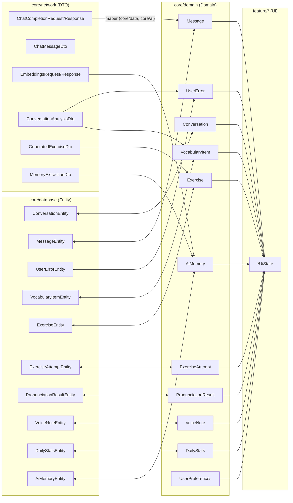

# ETAP 13 — Modele danych

> Dokument zgodny z kanonicznym briefem (`00-brief-decyzje-projektowe.md`).
> Trzy warstwy modeli: **Encje Room** (`*Entity`, moduł `core/database`),
> **modele domenowe** (czysty Kotlin, moduł `core/domain`),
> **DTO sieciowe** (`*Dto`/`*Request`/`*Response`, moduł `core/network`).
> Mapowanie odbywa się wyłącznie w `core/data` (Entity↔Domain) oraz
> `core/network`+`core/data` (Dto→Domain).

## 1. Zasady warstwowania (reguły twarde)

1. **DTO nie wycieka poza `core/network` + `core/data`.** ViewModel, use case ani UI
   nigdy nie widzą `ChatCompletionResponse` — repozytorium zwraca modele domenowe.
2. **Entity nie wycieka poza `core/database` + `core/data`.** DAO zwracają `*Entity`,
   implementacje repozytoriów mapują je na modele domenowe.
3. **Domain jest czysty:** brak adnotacji Room/Serialization, brak zależności od
   Androida. Tylko Kotlin + `kotlinx.datetime`/`java.time` (toolchain 17, minSdk 26 —
   używamy `java.time.Instant`/`LocalDate` bez desugaringu problemów).
4. **UI models:** konwencja `*UiState` — immutable `data class` definiowana obok
   ViewModelu w module `feature/*`, budowana z modeli domenowych (nigdy z Entity/DTO).
5. Mapery są funkcjami rozszerzającymi (`fun ConversationEntity.toDomain()`),
   trzymanymi w `core/data/mapper/` — testowalne unit testami bez Androida.

Przepływ: `DTO → (maper) → Domain ← (maper) ← Entity`, UI: `Domain → *UiState`.

## 2. Encje i modele — warstwa po warstwie

Identyfikatory: `String` (UUID v4 generowany po stronie aplikacji — ułatwia
przyszłą synchronizację, brak konfliktów autoincrement). Czas: `Instant`
(w Entity trzymany jako `Long` epoch millis przez TypeConverter — patrz etap 14).

### 2.1 Conversation (tabela `conversations`)

**Encja Room — `ConversationEntity`** (`core/database/entity/ConversationEntity.kt`):

```kotlin
@Entity(tableName = "conversations")
data class ConversationEntity(
    @PrimaryKey val id: String,
    val title: String,
    val scenario: String,            // np. "JOB_INTERVIEW", "SMALL_TALK", "FREE_TALK"
    val startedAt: Instant,          // TypeConverter → Long
    val endedAt: Instant?,           // null = rozmowa trwa
    val durationSec: Int,            // 0 dopóki nie zakończona
    val status: ConversationStatus,  // ACTIVE / COMPLETED / ANALYZED (converter → String)
    val summary: String?,            // podsumowanie z analizy AI
)
```

**Model domenowy — `Conversation`** (`core/domain/model/Conversation.kt`):

```kotlin
data class Conversation(
    val id: String,
    val title: String,
    val scenario: ConversationScenario,
    val startedAt: Instant,
    val endedAt: Instant?,
    val durationSec: Int,
    val status: ConversationStatus,
    val summary: String?,
)

enum class ConversationStatus { ACTIVE, COMPLETED, ANALYZED }

enum class ConversationScenario { FREE_TALK, JOB_INTERVIEW, SMALL_TALK, TRAVEL, BUSINESS_MEETING, RESTAURANT, PHONE_CALL, CUSTOM }
```

### 2.2 Message (tabela `messages`)

**`MessageEntity`:**

```kotlin
@Entity(
    tableName = "messages",
    foreignKeys = [ForeignKey(
        entity = ConversationEntity::class,
        parentColumns = ["id"], childColumns = ["conversationId"],
        onDelete = ForeignKey.CASCADE,
    )],
    indices = [Index("conversationId")],
)
data class MessageEntity(
    @PrimaryKey val id: String,
    val conversationId: String,
    val role: MessageRole,        // USER / ASSISTANT (converter → String)
    val content: String,
    val translation: String?,     // tłumaczenie PL na żądanie
    val audioPath: String?,       // ścieżka nagrania (kasowana po transkrypcji)
    val createdAt: Instant,
)
```

**Domain — `Message`:**

```kotlin
data class Message(
    val id: String,
    val conversationId: String,
    val role: MessageRole,
    val content: String,
    val translation: String? = null,
    val audioPath: String? = null,
    val createdAt: Instant,
)

enum class MessageRole { USER, ASSISTANT }
```

### 2.3 UserError (tabela `user_errors`)

**`UserErrorEntity`:**

```kotlin
@Entity(
    tableName = "user_errors",
    foreignKeys = [ForeignKey(
        entity = ConversationEntity::class,
        parentColumns = ["id"], childColumns = ["conversationId"],
        onDelete = ForeignKey.SET_NULL,
    )],
    indices = [Index("conversationId"), Index("category")],
)
data class UserErrorEntity(
    @PrimaryKey val id: String,
    val conversationId: String?,      // null gdy błąd spoza rozmowy (np. ćwiczenie)
    val category: ErrorCategory,      // GRAMMAR / VOCABULARY / PRONUNCIATION / FLUENCY
    val original: String,
    val corrected: String,
    val explanation: String,          // wyjaśnienie po polsku
    val createdAt: Instant,
    val resolvedAt: Instant?,         // ustawiane, gdy uznany za opanowany
)
```

**Domain — `UserError`:**

```kotlin
data class UserError(
    val id: String,
    val conversationId: String?,
    val category: ErrorCategory,
    val original: String,
    val corrected: String,
    val explanation: String,
    val createdAt: Instant,
    val resolvedAt: Instant? = null,
) {
    val isResolved: Boolean get() = resolvedAt != null
}

enum class ErrorCategory { GRAMMAR, VOCABULARY, PRONUNCIATION, FLUENCY }
```

### 2.4 VocabularyItem (tabela `vocabulary_items`)

**`VocabularyItemEntity`:**

```kotlin
@Entity(
    tableName = "vocabulary_items",
    indices = [Index(value = ["word"], unique = true), Index("dueAt"), Index("status")],
)
data class VocabularyItemEntity(
    @PrimaryKey val id: String,
    val word: String,
    val translation: String,
    val definition: String,
    val example: String,
    val sourceConversationId: String?,   // skąd wykryte (bez FK — patrz etap 14)
    val status: VocabularyStatus,        // NEW / LEARNING / MASTERED
    val easeFactor: Float,               // SM-2, start 2.5
    val intervalDays: Int,               // SM-2: 1 → 6 → EF*n
    val repetitionCount: Int,
    val dueAt: Instant,
    val createdAt: Instant,
)
```

**Domain — `VocabularyItem`:**

```kotlin
data class VocabularyItem(
    val id: String,
    val word: String,
    val translation: String,
    val definition: String,
    val example: String,
    val sourceConversationId: String? = null,
    val status: VocabularyStatus = VocabularyStatus.NEW,
    val easeFactor: Float = 2.5f,
    val intervalDays: Int = 0,
    val repetitionCount: Int = 0,
    val dueAt: Instant,
    val createdAt: Instant,
)

enum class VocabularyStatus { NEW, LEARNING, MASTERED }
```

### 2.5 Exercise (tabela `exercises`)

**`ExerciseEntity`:**

```kotlin
@Entity(
    tableName = "exercises",
    foreignKeys = [ForeignKey(
        entity = UserErrorEntity::class,
        parentColumns = ["id"], childColumns = ["sourceErrorId"],
        onDelete = ForeignKey.SET_NULL,
    )],
    indices = [Index("sourceErrorId"), Index("dueAt")],
)
data class ExerciseEntity(
    @PrimaryKey val id: String,
    val type: ExerciseType,          // FILL_GAP / MULTIPLE_CHOICE / TRANSLATION / SPEAKING
    val question: String,
    val options: List<String>,       // TypeConverter → JSON (TEXT)
    val correctAnswer: String,
    val explanation: String,
    val sourceErrorId: String?,
    val easeFactor: Float,
    val intervalDays: Int,
    val repetitionCount: Int,
    val dueAt: Instant,
    val createdAt: Instant,
)
```

**Domain — `Exercise`:**

```kotlin
data class Exercise(
    val id: String,
    val type: ExerciseType,
    val question: String,
    val options: List<String> = emptyList(),   // puste dla FILL_GAP/TRANSLATION/SPEAKING
    val correctAnswer: String,
    val explanation: String,
    val sourceErrorId: String? = null,
    val easeFactor: Float = 2.5f,
    val intervalDays: Int = 0,
    val repetitionCount: Int = 0,
    val dueAt: Instant,
    val createdAt: Instant,
)

enum class ExerciseType { FILL_GAP, MULTIPLE_CHOICE, TRANSLATION, SPEAKING }
```

### 2.6 ExerciseAttempt (tabela `exercise_attempts`)

**`ExerciseAttemptEntity`:**

```kotlin
@Entity(
    tableName = "exercise_attempts",
    foreignKeys = [ForeignKey(
        entity = ExerciseEntity::class,
        parentColumns = ["id"], childColumns = ["exerciseId"],
        onDelete = ForeignKey.CASCADE,
    )],
    indices = [Index("exerciseId")],
)
data class ExerciseAttemptEntity(
    @PrimaryKey val id: String,
    val exerciseId: String,
    val userAnswer: String,
    val isCorrect: Boolean,
    val attemptedAt: Instant,
)
```

**Domain — `ExerciseAttempt`:**

```kotlin
data class ExerciseAttempt(
    val id: String,
    val exerciseId: String,
    val userAnswer: String,
    val isCorrect: Boolean,
    val attemptedAt: Instant,
)
```

### 2.7 PronunciationResult (tabela `pronunciation_results`)

**`PronunciationResultEntity`:**

```kotlin
@Entity(tableName = "pronunciation_results", indices = [Index("word")])
data class PronunciationResultEntity(
    @PrimaryKey val id: String,
    val word: String,
    val expectedText: String,
    val recognizedText: String,
    val score: Int,            // 0–100
    val feedback: String,      // feedback LLM po polsku
    val createdAt: Instant,
)
```

**Domain — `PronunciationResult`:** te same pola, czysty data class (`score` z
`init { require(score in 0..100) }`).

### 2.8 VoiceNote (tabela `voice_notes`)

**`VoiceNoteEntity`:**

```kotlin
@Entity(tableName = "voice_notes")
data class VoiceNoteEntity(
    @PrimaryKey val id: String,
    val title: String,
    val audioPath: String,
    val transcription: String?,   // null dopóki nie ztranskrybowana
    val durationSec: Int,
    val createdAt: Instant,
)
```

**Domain — `VoiceNote`:** identyczne pola, czysty data class.

### 2.9 DailyStats (tabela `daily_stats`)

**`DailyStatsEntity`:**

```kotlin
@Entity(tableName = "daily_stats")
data class DailyStatsEntity(
    @PrimaryKey val date: LocalDate,      // TypeConverter → String "yyyy-MM-dd"
    val conversationSec: Int,
    val messagesSent: Int,
    val wordsLearned: Int,
    val exercisesDone: Int,
    val exercisesCorrect: Int,
    val pronunciationAvg: Float?,         // null = brak treningu wymowy tego dnia
)
```

**Domain — `DailyStats`:** identyczne pola + pochodne
`val exerciseAccuracy: Float? get() = ...` (exercisesCorrect/exercisesDone).

### 2.10 AiMemory (tabela `ai_memories`)

**`AiMemoryEntity`:**

```kotlin
@Entity(tableName = "ai_memories", indices = [Index("kind"), Index("importance")])
data class AiMemoryEntity(
    @PrimaryKey val id: String,
    val kind: MemoryKind,          // FACT / PREFERENCE / WEAKNESS / GOAL / PROGRESS
    val content: String,           // treść wspomnienia po angielsku
    val embedding: FloatArray?,    // TypeConverter → BLOB; null = jeszcze nie policzony
    val importance: Float,         // 0.0–1.0
    val createdAt: Instant,
    val updatedAt: Instant,
)
```

**Domain — `AiMemory`:**

```kotlin
data class AiMemory(
    val id: String,
    val kind: MemoryKind,
    val content: String,
    val embedding: FloatArray? = null,
    val importance: Float,
    val createdAt: Instant,
    val updatedAt: Instant,
)

enum class MemoryKind { FACT, PREFERENCE, WEAKNESS, GOAL, PROGRESS }
```

Uwaga: `FloatArray` w data class wymaga nadpisania `equals`/`hashCode`
(porównanie `contentEquals`) — generujemy je ręcznie w obu klasach.

### 2.11 UserPreferences (DataStore — nie Room)

**Domain — `UserPreferences`** (`core/domain/model/UserPreferences.kt`), zgodnie
z briefem (rozdz. 6):

```kotlin
data class UserPreferences(
    val onboardingCompleted: Boolean = false,
    val englishLevel: EnglishLevel = EnglishLevel.B1,   // A2 / B1 / B2 / C1
    val dailyGoalMinutes: Int = 10,
    val learningGoals: List<LearningGoal> = emptyList(),
    val ttsVoice: TtsVoice = TtsVoice.US,               // US / UK
    val ttsSpeed: Float = 1.0f,
    val aiModel: String = "gpt-4o-mini",
    val theme: ThemePreference = ThemePreference.SYSTEM,
    // apiKey NIE jest polem tego modelu — żyje wyłącznie w EncryptedSharedPreferences
    // i jest czytany przez ApiKeyProvider w core/datastore (patrz etap 14).
)

enum class EnglishLevel { A2, B1, B2, C1 }
enum class LearningGoal { WORK, TRAVEL, EXAMS, SOCIAL, MOVING_ABROAD, GENERAL_FLUENCY }
enum class TtsVoice { US, UK }
enum class ThemePreference { LIGHT, DARK, SYSTEM }
```

## 3. DTO sieciowe (OpenAI) — `core/network`

Wszystkie DTO z `@Serializable` (Kotlinx Serialization 1.7.3), nazwy pól JSON przez
`@SerialName`. Pakiet `com.aienglishcoach.core.network.dto`.

### 3.1 Chat Completions

```kotlin
@Serializable
data class ChatCompletionRequest(
    val model: String,                          // np. "gpt-4o-mini"
    val messages: List<ChatMessageDto>,
    val temperature: Float? = null,
    @SerialName("max_tokens") val maxTokens: Int? = null,
    @SerialName("response_format") val responseFormat: ResponseFormatDto? = null,
)

@Serializable
data class ChatMessageDto(
    val role: String,        // "system" | "user" | "assistant"
    val content: String,
)

@Serializable
data class ResponseFormatDto(val type: String)   // "json_object" dla structured output

@Serializable
data class ChatCompletionResponse(
    val id: String,
    val model: String,
    val choices: List<ChatChoiceDto>,
    val usage: UsageDto? = null,
)

@Serializable
data class ChatChoiceDto(
    val index: Int,
    val message: ChatMessageDto,
    @SerialName("finish_reason") val finishReason: String? = null,
)

@Serializable
data class UsageDto(
    @SerialName("prompt_tokens") val promptTokens: Int,
    @SerialName("completion_tokens") val completionTokens: Int,
    @SerialName("total_tokens") val totalTokens: Int,
)
```

### 3.2 Embeddings

```kotlin
@Serializable
data class EmbeddingsRequest(
    val model: String,               // "text-embedding-3-small"
    val input: List<String>,
)

@Serializable
data class EmbeddingsResponse(
    val data: List<EmbeddingDto>,
    val model: String,
    val usage: EmbeddingsUsageDto? = null,
)

@Serializable
data class EmbeddingDto(
    val index: Int,
    val embedding: List<Float>,      // 1536 wymiarów
)

@Serializable
data class EmbeddingsUsageDto(
    @SerialName("prompt_tokens") val promptTokens: Int,
    @SerialName("total_tokens") val totalTokens: Int,
)
```

### 3.3 Structured output — JSON-y parsowane z `choices[0].message.content`

To NIE są odpowiedzi HTTP, tylko payloady JSON zwrócone przez model przy
`response_format = json_object`; parsujemy je w `core/ai` tym samym `Json`
(`ignoreUnknownKeys = true`, `coerceInputValues = true`).

**`ConversationAnalysisDto`** — wynik analizy rozmowy:

```kotlin
@Serializable
data class ConversationAnalysisDto(
    val summary: String,
    val errors: List<DetectedErrorDto>,
    val vocabulary: List<DetectedVocabularyDto>,
    @SerialName("overall_feedback") val overallFeedback: String,
)

@Serializable
data class DetectedErrorDto(
    val category: String,        // "GRAMMAR" | "VOCABULARY" | "PRONUNCIATION" | "FLUENCY"
    val original: String,
    val corrected: String,
    val explanation: String,     // po polsku
)

@Serializable
data class DetectedVocabularyDto(
    val word: String,
    val translation: String,
    val definition: String,
    val example: String,
)
```

**`GeneratedExerciseDto`** — wynik generatora ćwiczeń:

```kotlin
@Serializable
data class GeneratedExercisesDto(
    val exercises: List<GeneratedExerciseDto>,
)

@Serializable
data class GeneratedExerciseDto(
    val type: String,            // "FILL_GAP" | "MULTIPLE_CHOICE" | "TRANSLATION" | "SPEAKING"
    val question: String,
    val options: List<String> = emptyList(),
    @SerialName("correct_answer") val correctAnswer: String,
    val explanation: String,
    @SerialName("source_error_id") val sourceErrorId: String? = null,
)
```

**`MemoryExtractionDto`** — wynik konsolidatora pamięci:

```kotlin
@Serializable
data class MemoryExtractionDto(
    val memories: List<ExtractedMemoryDto>,
)

@Serializable
data class ExtractedMemoryDto(
    val kind: String,            // "FACT" | "PREFERENCE" | "WEAKNESS" | "GOAL" | "PROGRESS"
    val content: String,
    val importance: Float,       // 0.0–1.0
)
```

## 4. Mapery

### 4.1 Entity ↔ Domain (`core/data/mapper/`)

Dwukierunkowe, symetryczne, po jednym pliku na agregat:

```kotlin
// ConversationMapper.kt
fun ConversationEntity.toDomain(): Conversation = Conversation(
    id = id, title = title,
    scenario = ConversationScenario.valueOf(scenario),
    startedAt = startedAt, endedAt = endedAt,
    durationSec = durationSec, status = status, summary = summary,
)

fun Conversation.toEntity(): ConversationEntity = ConversationEntity(
    id = id, title = title, scenario = scenario.name,
    startedAt = startedAt, endedAt = endedAt,
    durationSec = durationSec, status = status, summary = summary,
)
```

Analogicznie: `MessageMapper`, `UserErrorMapper`, `VocabularyItemMapper`,
`ExerciseMapper`, `ExerciseAttemptMapper`, `PronunciationResultMapper`,
`VoiceNoteMapper`, `DailyStatsMapper`, `AiMemoryMapper`.

Zasady:
- enumy w Entity przechowywane jako `String` (converter) — mapowanie przez
  `valueOf` z fallbackiem (`runCatching { valueOf(x) }.getOrDefault(...)`) dla
  odporności na przyszłe migracje;
- mapowanie nie robi I/O ani walidacji biznesowej — to czysta translacja.

### 4.2 Dto → Domain (jednokierunkowe, `core/data/mapper/` + `core/ai`)

DTO mapujemy tylko *do* domeny (nigdy odwrotnie — requesty budują dedykowane
buildery w `core/ai`):

```kotlin
fun DetectedErrorDto.toDomain(conversationId: String, now: Instant): UserError = UserError(
    id = UUID.randomUUID().toString(),
    conversationId = conversationId,
    category = ErrorCategory.valueOf(category),
    original = original, corrected = corrected, explanation = explanation,
    createdAt = now,
)

fun GeneratedExerciseDto.toDomain(now: Instant): Exercise = Exercise(
    id = UUID.randomUUID().toString(),
    type = ExerciseType.valueOf(type),
    question = question, options = options,
    correctAnswer = correctAnswer, explanation = explanation,
    sourceErrorId = sourceErrorId,
    dueAt = now,            // nowe ćwiczenie od razu due
    createdAt = now,
)

fun ExtractedMemoryDto.toDomain(now: Instant): AiMemory = AiMemory(
    id = UUID.randomUUID().toString(),
    kind = MemoryKind.valueOf(kind),
    content = content,
    importance = importance.coerceIn(0f, 1f),
    createdAt = now, updatedAt = now,
)
```

Nieznana wartość enuma z LLM (np. `"SPELLING"`) ⇒ element jest **odrzucany z
logiem Timber**, nie wywala całej analizy (`mapNotNull`).

### 4.3 Domain → UiState (`feature/*`)

Każdy ViewModel utrzymuje jeden `StateFlow<XxxUiState>`; UiState to płaska,
immutable data class gotowa do renderu (sformatowane daty/czasy, teksty PL):

```kotlin
data class ConversationUiState(
    val messages: List<MessageUi> = emptyList(),
    val micState: MicState = MicState.Idle,     // idle/listening/processing/speaking
    val partialTranscript: String = "",
    val isAiTyping: Boolean = false,
    val error: String? = null,
)
```

Konwencje: `HomeUiState`, `ConversationListUiState`, `ConversationUiState`,
`ConversationSummaryUiState`, `ExercisesUiState`, `ExercisePlayerUiState`,
`VocabularyUiState`, `VocabularyReviewUiState`, `PronunciationUiState`,
`VoiceNotesUiState`, `StatisticsUiState`, `SettingsUiState` — po jednym na ekran
z etapu 3 briefu.

## 5. Diagram relacji modeli



Relacje między encjami (szczegóły w etapie 14): `conversations 1—N messages`,
`conversations 1—N user_errors`, `user_errors 1—N exercises` (przez
`sourceErrorId`), `exercises 1—N exercise_attempts`.

## 6. Checklista zgodności

- [x] Wszystkie tabele/encje z briefu (rozdz. 6) mają trzy warstwy modeli.
- [x] Nazwy 1:1 z briefem: `ConversationEntity`…`AiMemoryEntity`, domain
  `Conversation`…`AiMemory`, `UserPreferences`.
- [x] DTO tylko w `core/network`; parsowanie structured output w `core/ai`.
- [x] Mapery w `core/data/mapper`, funkcje rozszerzające, bez logiki biznesowej.
- [x] UI: wyłącznie `*UiState` w `feature/*`.
