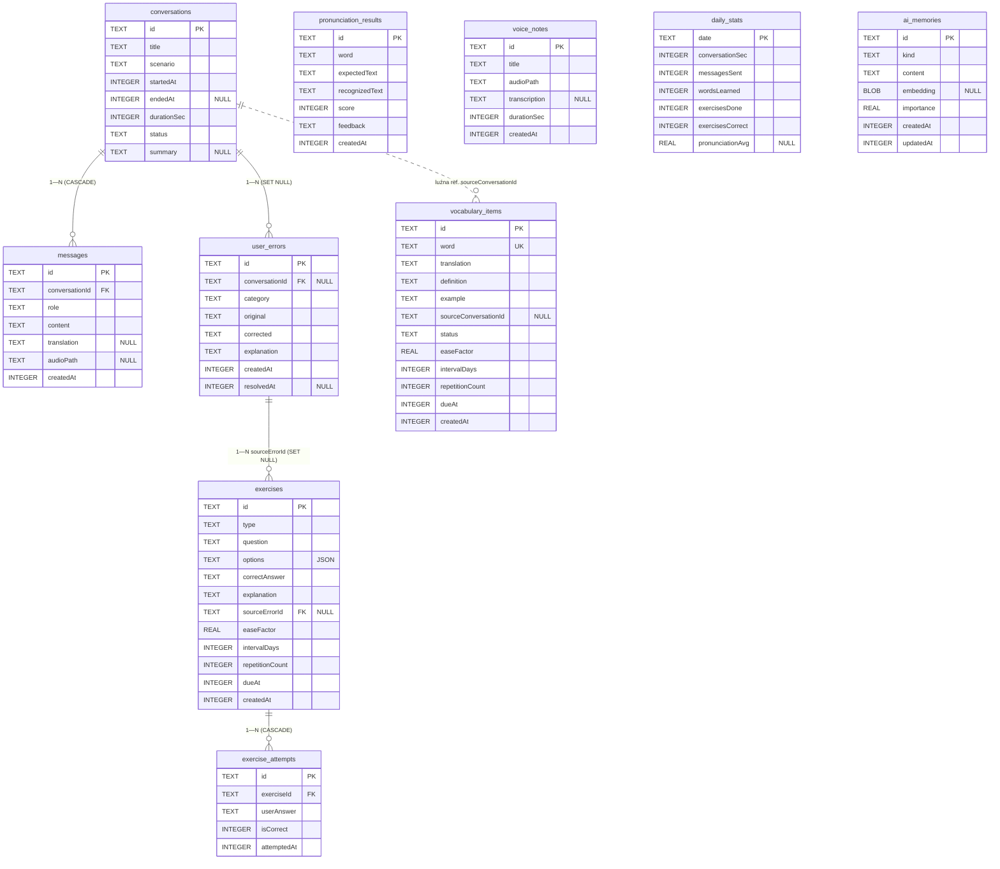

# ETAP 14 — Baza danych (Room + DataStore)

> Zgodnie z briefem: Room 2.6.1 jest **źródłem prawdy** (offline-first), DataStore 1.1.1
> przechowuje `UserPreferences`, klucz API leży w EncryptedSharedPreferences
> (security-crypto). Moduł: `core/database` (encje, DAO, baza, konwertery),
> `core/datastore` (preferencje + klucz API).

## 1. Przegląd

- Baza: `CoachDatabase : RoomDatabase`, plik `ai_english_coach.db`, wersja `1`.
- 10 tabel kanonicznych: `conversations`, `messages`, `user_errors`,
  `vocabulary_items`, `exercises`, `exercise_attempts`, `pronunciation_results`,
  `voice_notes`, `daily_stats`, `ai_memories`.
- Klucze główne: `TEXT` (UUID generowane w aplikacji) — bezkonfliktowe przy
  przyszłej synchronizacji chmurowej (S6). Wyjątek: `daily_stats` z PK `date`.
- Czas: `INTEGER` (epoch millis, konwerter `Instant↔Long`); daty kalendarzowe:
  `TEXT` ISO-8601 (`LocalDate↔String`) — czytelne w SQL i stabilne przy sortowaniu.

## 2. Schemat tabel (SQL)

### 2.1 `conversations`

| Kolumna | Typ SQL | Nullable | Default | Uwagi |
|---|---|---|---|---|
| `id` | TEXT | NIE | — | PK (UUID) |
| `title` | TEXT | NIE | — | |
| `scenario` | TEXT | NIE | — | enum jako String |
| `startedAt` | INTEGER | NIE | — | epoch millis |
| `endedAt` | INTEGER | TAK | NULL | null = trwa |
| `durationSec` | INTEGER | NIE | 0 | |
| `status` | TEXT | NIE | 'ACTIVE' | ACTIVE/COMPLETED/ANALYZED |
| `summary` | TEXT | TAK | NULL | z analizy AI |

Indeksy: `INDEX index_conversations_startedAt (startedAt)` — sortowanie historii.

### 2.2 `messages`

| Kolumna | Typ SQL | Nullable | Default | Uwagi |
|---|---|---|---|---|
| `id` | TEXT | NIE | — | PK |
| `conversationId` | TEXT | NIE | — | FK → conversations(id) `ON DELETE CASCADE` |
| `role` | TEXT | NIE | — | USER/ASSISTANT |
| `content` | TEXT | NIE | — | |
| `translation` | TEXT | TAK | NULL | tłumaczenie PL |
| `audioPath` | TEXT | TAK | NULL | kasowane po transkrypcji |
| `createdAt` | INTEGER | NIE | — | |

Indeksy: `index_messages_conversationId (conversationId)` (wymagany dla FK),
`index_messages_createdAt (createdAt)`.

### 2.3 `user_errors`

| Kolumna | Typ SQL | Nullable | Default | Uwagi |
|---|---|---|---|---|
| `id` | TEXT | NIE | — | PK |
| `conversationId` | TEXT | TAK | NULL | FK → conversations(id) `ON DELETE SET NULL` |
| `category` | TEXT | NIE | — | GRAMMAR/VOCABULARY/PRONUNCIATION/FLUENCY |
| `original` | TEXT | NIE | — | |
| `corrected` | TEXT | NIE | — | |
| `explanation` | TEXT | NIE | — | po polsku |
| `createdAt` | INTEGER | NIE | — | |
| `resolvedAt` | INTEGER | TAK | NULL | opanowany błąd |

Indeksy: `conversationId`, `category` (statystyki per kategoria),
`resolvedAt` (filtr aktywnych błędów do generatora ćwiczeń).

`ON DELETE SET NULL` (nie CASCADE): błąd użytkownika jest wartościowy nawet po
skasowaniu rozmowy — z niego żyją ćwiczenia i statystyki.

### 2.4 `vocabulary_items`

| Kolumna | Typ SQL | Nullable | Default | Uwagi |
|---|---|---|---|---|
| `id` | TEXT | NIE | — | PK |
| `word` | TEXT | NIE | — | UNIQUE |
| `translation` | TEXT | NIE | — | |
| `definition` | TEXT | NIE | — | |
| `example` | TEXT | NIE | — | |
| `sourceConversationId` | TEXT | TAK | NULL | **bez FK** — luźna referencja, słówko przeżywa rozmowę |
| `status` | TEXT | NIE | 'NEW' | NEW/LEARNING/MASTERED |
| `easeFactor` | REAL | NIE | 2.5 | SM-2 |
| `intervalDays` | INTEGER | NIE | 0 | SM-2 |
| `repetitionCount` | INTEGER | NIE | 0 | SM-2 |
| `dueAt` | INTEGER | NIE | — | następna powtórka |
| `createdAt` | INTEGER | NIE | — | |

Indeksy: `UNIQUE index_vocabulary_items_word (word)` — deduplikacja przy analizie,
`index_vocabulary_items_dueAt (dueAt)` — zapytanie o due, `status`.

### 2.5 `exercises`

| Kolumna | Typ SQL | Nullable | Default | Uwagi |
|---|---|---|---|---|
| `id` | TEXT | NIE | — | PK |
| `type` | TEXT | NIE | — | FILL_GAP/MULTIPLE_CHOICE/TRANSLATION/SPEAKING |
| `question` | TEXT | NIE | — | |
| `options` | TEXT | NIE | '[]' | JSON `List<String>` |
| `correctAnswer` | TEXT | NIE | — | |
| `explanation` | TEXT | NIE | — | |
| `sourceErrorId` | TEXT | TAK | NULL | FK → user_errors(id) `ON DELETE SET NULL` |
| `easeFactor` | REAL | NIE | 2.5 | SM-2 |
| `intervalDays` | INTEGER | NIE | 0 | |
| `repetitionCount` | INTEGER | NIE | 0 | |
| `dueAt` | INTEGER | NIE | — | |
| `createdAt` | INTEGER | NIE | — | |

Indeksy: `sourceErrorId` (FK), `dueAt`.

### 2.6 `exercise_attempts`

| Kolumna | Typ SQL | Nullable | Default | Uwagi |
|---|---|---|---|---|
| `id` | TEXT | NIE | — | PK |
| `exerciseId` | TEXT | NIE | — | FK → exercises(id) `ON DELETE CASCADE` |
| `userAnswer` | TEXT | NIE | — | |
| `isCorrect` | INTEGER | NIE | — | boolean 0/1 |
| `attemptedAt` | INTEGER | NIE | — | |

Indeksy: `exerciseId`, `attemptedAt` (statystyki dzienne).

### 2.7 `pronunciation_results`

| Kolumna | Typ SQL | Nullable | Default | Uwagi |
|---|---|---|---|---|
| `id` | TEXT | NIE | — | PK |
| `word` | TEXT | NIE | — | trenowane słowo |
| `expectedText` | TEXT | NIE | — | |
| `recognizedText` | TEXT | NIE | — | wynik STT |
| `score` | INTEGER | NIE | — | 0–100 |
| `feedback` | TEXT | NIE | — | feedback LLM |
| `createdAt` | INTEGER | NIE | — | |

Indeksy: `word` (historia prób per słowo), `createdAt`.

### 2.8 `voice_notes`

| Kolumna | Typ SQL | Nullable | Default | Uwagi |
|---|---|---|---|---|
| `id` | TEXT | NIE | — | PK |
| `title` | TEXT | NIE | — | |
| `audioPath` | TEXT | NIE | — | plik w storage aplikacji |
| `transcription` | TEXT | TAK | NULL | |
| `durationSec` | INTEGER | NIE | 0 | |
| `createdAt` | INTEGER | NIE | — | |

Indeks: `createdAt`.

### 2.9 `daily_stats`

| Kolumna | Typ SQL | Nullable | Default | Uwagi |
|---|---|---|---|---|
| `date` | TEXT | NIE | — | **PK**, ISO "yyyy-MM-dd" |
| `conversationSec` | INTEGER | NIE | 0 | |
| `messagesSent` | INTEGER | NIE | 0 | |
| `wordsLearned` | INTEGER | NIE | 0 | |
| `exercisesDone` | INTEGER | NIE | 0 | |
| `exercisesCorrect` | INTEGER | NIE | 0 | |
| `pronunciationAvg` | REAL | TAK | NULL | średni score dnia |

PK = `date` ⇒ upsert (`@Upsert`) agreguje w miejscu; brak dodatkowych indeksów
(zapytania zakresowe po PK są tanie, TEXT ISO sortuje się leksykograficznie = chronologicznie).

### 2.10 `ai_memories`

| Kolumna | Typ SQL | Nullable | Default | Uwagi |
|---|---|---|---|---|
| `id` | TEXT | NIE | — | PK |
| `kind` | TEXT | NIE | — | FACT/PREFERENCE/WEAKNESS/GOAL/PROGRESS |
| `content` | TEXT | NIE | — | po angielsku |
| `embedding` | BLOB | TAK | NULL | 1536×Float = 6144 B |
| `importance` | REAL | NIE | 0.5 | 0.0–1.0 |
| `createdAt` | INTEGER | NIE | — | |
| `updatedAt` | INTEGER | NIE | — | |

Indeksy: `kind`, `importance` (pruning: najpierw najmniej ważne).
Podobieństwo kosinusowe liczone w Kotlinie po załadowaniu wszystkich wspomnień
(skala: setki rekordów — patrz etap 16), więc brak indeksu wektorowego.

## 3. Diagram ERD



## 4. TypeConvertery (`core/database/converter/`)

```kotlin
class InstantConverter {
    @TypeConverter fun fromInstant(value: Instant?): Long? = value?.toEpochMilli()
    @TypeConverter fun toInstant(value: Long?): Instant? = value?.let(Instant::ofEpochMilli)
}

class LocalDateConverter {
    @TypeConverter fun fromLocalDate(value: LocalDate?): String? = value?.toString()   // ISO yyyy-MM-dd
    @TypeConverter fun toLocalDate(value: String?): LocalDate? = value?.let(LocalDate::parse)
}

class StringListConverter {
    private val json = Json { ignoreUnknownKeys = true }
    @TypeConverter fun fromList(value: List<String>): String = json.encodeToString(value)
    @TypeConverter fun toList(value: String): List<String> =
        runCatching { json.decodeFromString<List<String>>(value) }.getOrDefault(emptyList())
}

class FloatArrayConverter {
    // 1536 floatów → 6144 bajtów little-endian
    @TypeConverter fun fromFloatArray(value: FloatArray?): ByteArray? = value?.let {
        ByteBuffer.allocate(it.size * 4).order(ByteOrder.LITTLE_ENDIAN)
            .apply { it.forEach(::putFloat) }.array()
    }
    @TypeConverter fun toFloatArray(value: ByteArray?): FloatArray? = value?.let {
        val buf = ByteBuffer.wrap(it).order(ByteOrder.LITTLE_ENDIAN)
        FloatArray(it.size / 4) { buf.getFloat() }
    }
}

class EnumConverters {
    @TypeConverter fun fromStatus(v: ConversationStatus): String = v.name
    @TypeConverter fun toStatus(v: String): ConversationStatus = ConversationStatus.valueOf(v)
    // ...analogicznie: MessageRole, ErrorCategory, VocabularyStatus, ExerciseType, MemoryKind
}
```

Rejestracja: `@TypeConverters(InstantConverter::class, LocalDateConverter::class,
StringListConverter::class, FloatArrayConverter::class, EnumConverters::class)`
na klasie `CoachDatabase`.

## 5. DAO (po jednym na tabelę, `core/database/dao/`)

Konwencje: odczyty obserwowalne przez `Flow<...>` (Room emituje przy zmianie
tabeli), zapisy `suspend`, upserty przez `@Upsert`. DAO zwracają wyłącznie
`*Entity` — mapowanie w `core/data`.

```kotlin
@Dao
interface ConversationDao {
    @Query("SELECT * FROM conversations ORDER BY startedAt DESC")
    fun observeAll(): Flow<List<ConversationEntity>>

    @Query("SELECT * FROM conversations WHERE id = :id")
    fun observeById(id: String): Flow<ConversationEntity?>

    @Query("SELECT * FROM conversations WHERE id = :id")
    suspend fun getById(id: String): ConversationEntity?

    @Upsert suspend fun upsert(entity: ConversationEntity)

    @Query("UPDATE conversations SET status = :status, endedAt = :endedAt, durationSec = :durationSec WHERE id = :id")
    suspend fun finish(id: String, status: ConversationStatus, endedAt: Instant, durationSec: Int)

    @Query("UPDATE conversations SET summary = :summary, status = 'ANALYZED' WHERE id = :id")
    suspend fun setSummary(id: String, summary: String)

    @Query("DELETE FROM conversations WHERE id = :id")
    suspend fun deleteById(id: String)
}

@Dao
interface MessageDao {
    @Query("SELECT * FROM messages WHERE conversationId = :conversationId ORDER BY createdAt ASC")
    fun observeByConversation(conversationId: String): Flow<List<MessageEntity>>

    @Query("SELECT * FROM messages WHERE conversationId = :conversationId ORDER BY createdAt DESC LIMIT :limit")
    suspend fun getLastMessages(conversationId: String, limit: Int): List<MessageEntity>  // okno kontekstu N=30

    @Insert suspend fun insert(entity: MessageEntity)

    @Query("UPDATE messages SET translation = :translation WHERE id = :id")
    suspend fun setTranslation(id: String, translation: String)

    @Query("UPDATE messages SET audioPath = NULL WHERE id = :id")
    suspend fun clearAudioPath(id: String)   // prywatność: audio kasowane po transkrypcji
}

@Dao
interface UserErrorDao {
    @Query("SELECT * FROM user_errors ORDER BY createdAt DESC")
    fun observeAll(): Flow<List<UserErrorEntity>>

    @Query("SELECT * FROM user_errors WHERE conversationId = :conversationId")
    fun observeByConversation(conversationId: String): Flow<List<UserErrorEntity>>

    @Query("SELECT * FROM user_errors WHERE resolvedAt IS NULL ORDER BY createdAt DESC LIMIT :limit")
    suspend fun getUnresolved(limit: Int): List<UserErrorEntity>   // wejście generatora ćwiczeń

    @Query("SELECT category, COUNT(*) AS count FROM user_errors GROUP BY category")
    fun observeCountByCategory(): Flow<List<CategoryCount>>

    @Insert suspend fun insertAll(entities: List<UserErrorEntity>)

    @Query("UPDATE user_errors SET resolvedAt = :resolvedAt WHERE id = :id")
    suspend fun markResolved(id: String, resolvedAt: Instant)
}

@Dao
interface VocabularyItemDao {
    @Query("SELECT * FROM vocabulary_items ORDER BY createdAt DESC")
    fun observeAll(): Flow<List<VocabularyItemEntity>>

    @Query("SELECT * FROM vocabulary_items WHERE status = :status ORDER BY createdAt DESC")
    fun observeByStatus(status: VocabularyStatus): Flow<List<VocabularyItemEntity>>

    @Query("SELECT * FROM vocabulary_items WHERE dueAt <= :now ORDER BY dueAt ASC")
    fun observeDue(now: Instant): Flow<List<VocabularyItemEntity>>

    @Query("SELECT COUNT(*) FROM vocabulary_items WHERE dueAt <= :now")
    fun observeDueCount(now: Instant): Flow<Int>

    @Query("SELECT * FROM vocabulary_items WHERE word = :word LIMIT 1")
    suspend fun getByWord(word: String): VocabularyItemEntity?     // deduplikacja

    @Upsert suspend fun upsert(entity: VocabularyItemEntity)

    @Query("UPDATE vocabulary_items SET easeFactor = :ef, intervalDays = :interval, repetitionCount = :reps, dueAt = :dueAt, status = :status WHERE id = :id")
    suspend fun applyReview(id: String, ef: Float, interval: Int, reps: Int, dueAt: Instant, status: VocabularyStatus)
}

@Dao
interface ExerciseDao {
    @Query("SELECT * FROM exercises ORDER BY createdAt DESC")
    fun observeAll(): Flow<List<ExerciseEntity>>

    @Query("SELECT * FROM exercises WHERE dueAt <= :now ORDER BY dueAt ASC LIMIT :limit")
    suspend fun getDue(now: Instant, limit: Int): List<ExerciseEntity>

    @Query("SELECT COUNT(*) FROM exercises WHERE dueAt <= :now")
    fun observeDueCount(now: Instant): Flow<Int>

    @Insert suspend fun insertAll(entities: List<ExerciseEntity>)

    @Query("UPDATE exercises SET easeFactor = :ef, intervalDays = :interval, repetitionCount = :reps, dueAt = :dueAt WHERE id = :id")
    suspend fun applyReview(id: String, ef: Float, interval: Int, reps: Int, dueAt: Instant)
}

@Dao
interface ExerciseAttemptDao {
    @Query("SELECT * FROM exercise_attempts WHERE exerciseId = :exerciseId ORDER BY attemptedAt DESC")
    fun observeByExercise(exerciseId: String): Flow<List<ExerciseAttemptEntity>>

    @Query("SELECT * FROM exercise_attempts WHERE attemptedAt BETWEEN :from AND :to")
    suspend fun getInRange(from: Instant, to: Instant): List<ExerciseAttemptEntity>

    @Insert suspend fun insert(entity: ExerciseAttemptEntity)
}

@Dao
interface PronunciationResultDao {
    @Query("SELECT * FROM pronunciation_results ORDER BY createdAt DESC")
    fun observeAll(): Flow<List<PronunciationResultEntity>>

    @Query("SELECT * FROM pronunciation_results WHERE word = :word ORDER BY createdAt DESC")
    fun observeByWord(word: String): Flow<List<PronunciationResultEntity>>

    @Query("SELECT AVG(score) FROM pronunciation_results WHERE createdAt >= :since")
    fun observeAverageScore(since: Instant): Flow<Float?>

    @Insert suspend fun insert(entity: PronunciationResultEntity)
}

@Dao
interface VoiceNoteDao {
    @Query("SELECT * FROM voice_notes ORDER BY createdAt DESC")
    fun observeAll(): Flow<List<VoiceNoteEntity>>

    @Insert suspend fun insert(entity: VoiceNoteEntity)

    @Query("UPDATE voice_notes SET transcription = :transcription WHERE id = :id")
    suspend fun setTranscription(id: String, transcription: String)

    @Query("DELETE FROM voice_notes WHERE id = :id")
    suspend fun deleteById(id: String)
}

@Dao
interface DailyStatsDao {
    @Query("SELECT * FROM daily_stats WHERE date = :date")
    fun observeByDate(date: LocalDate): Flow<DailyStatsEntity?>

    @Query("SELECT * FROM daily_stats WHERE date BETWEEN :from AND :to ORDER BY date ASC")
    fun observeRange(from: LocalDate, to: LocalDate): Flow<List<DailyStatsEntity>>

    @Query("SELECT * FROM daily_stats ORDER BY date DESC")
    suspend fun getAll(): List<DailyStatsEntity>    // liczenie streak

    @Upsert suspend fun upsert(entity: DailyStatsEntity)
}

@Dao
interface AiMemoryDao {
    @Query("SELECT * FROM ai_memories ORDER BY importance DESC, updatedAt DESC")
    fun observeAll(): Flow<List<AiMemoryEntity>>

    @Query("SELECT * FROM ai_memories WHERE embedding IS NOT NULL")
    suspend fun getAllWithEmbedding(): List<AiMemoryEntity>   // RAG: cosine w Kotlinie

    @Query("SELECT * FROM ai_memories WHERE kind = :kind")
    suspend fun getByKind(kind: MemoryKind): List<AiMemoryEntity>

    @Upsert suspend fun upsert(entity: AiMemoryEntity)

    @Query("SELECT COUNT(*) FROM ai_memories")
    suspend fun count(): Int

    @Query("DELETE FROM ai_memories WHERE id IN (:ids)")
    suspend fun deleteByIds(ids: List<String>)   // pruning
}
```

`CategoryCount` to prosty POJO wynikowy (`data class CategoryCount(val category: String, val count: Int)`).

Operacje wielotabelowe (np. zapis wyniku analizy: summary + błędy + słówka)
wykonujemy w `withTransaction { ... }` na poziomie repozytorium w `core/data`.

## 6. Definicja bazy

```kotlin
@Database(
    entities = [
        ConversationEntity::class, MessageEntity::class, UserErrorEntity::class,
        VocabularyItemEntity::class, ExerciseEntity::class, ExerciseAttemptEntity::class,
        PronunciationResultEntity::class, VoiceNoteEntity::class,
        DailyStatsEntity::class, AiMemoryEntity::class,
    ],
    version = 1,
    exportSchema = true,
)
@TypeConverters(/* jak w §4 */)
abstract class CoachDatabase : RoomDatabase() {
    abstract fun conversationDao(): ConversationDao
    abstract fun messageDao(): MessageDao
    abstract fun userErrorDao(): UserErrorDao
    abstract fun vocabularyItemDao(): VocabularyItemDao
    abstract fun exerciseDao(): ExerciseDao
    abstract fun exerciseAttemptDao(): ExerciseAttemptDao
    abstract fun pronunciationResultDao(): PronunciationResultDao
    abstract fun voiceNoteDao(): VoiceNoteDao
    abstract fun dailyStatsDao(): DailyStatsDao
    abstract fun aiMemoryDao(): AiMemoryDao
}
```

Hilt (`core/database/di/DatabaseModule.kt`): singleton
`Room.databaseBuilder(context, CoachDatabase::class.java, "ai_english_coach.db")`
(bez `fallbackToDestructiveMigration` w release!).

## 7. Strategia migracji

1. **`exportSchema = true`** + w Gradle
   `room { schemaDirectory("$projectDir/schemas") }` — pliki JSON schematu
   wersjonowane w repo (`core/database/schemas/…`). To warunek testów migracji.
2. **Wersjonowanie:** każda zmiana schematu ⇒ `version += 1` + jawna
   `Migration(n, n+1)` z ręcznym SQL. Zakaz destructive migration na danych
   użytkownika (offline-first ⇒ baza to jedyna kopia danych!).
3. **Testy migracji:** `MigrationTestHelper` (androidTest w `core/database`) —
   test tworzy bazę w wersji n z pliku schematu, wykonuje migrację, weryfikuje
   dane. Dodatkowo test "all migrations": otwarcie bazy v1 i przejście łańcuchem
   do najnowszej.
4. **AutoMigration** dopuszczalna dla trywialnych zmian (nowa kolumna z default),
   ale zawsze z testem.
5. Konwencja nazw: `MIGRATION_1_2` w pliku `CoachDatabaseMigrations.kt`.

## 8. Indeksy i wydajność

- Indeksy na **każdej kolumnie FK** (Room ostrzega, brak = full scan przy CASCADE).
- Indeksy pod główne zapytania list: `startedAt`, `createdAt`, `dueAt`, `status`,
  `category` — pokrywają ekrany historii, due powtórek i statystyk.
- `UNIQUE(word)` w `vocabulary_items` — deduplikacja na poziomie bazy.
- `Flow` z Room + `distinctUntilChanged()` w repozytoriach — mniej rekompozycji.
- Embeddingi (BLOB 6 KB/rekord): przy limicie ~500 wspomnień (pruning, etap 16)
  całość < 3 MB — ładowanie wszystkich do RAM przy RAG jest bezpieczne.
- Duże listy (historia rozmów, słownictwo) — w razie potrzeby Paging 3 (roadmapa);
  MVP: listy w całości, dane liczone w setkach rekordów.
- WAL (domyślny journal mode Room) — równoległe odczyty przy zapisie z workerów.

## 9. DataStore — `UserPreferences` (i dlaczego nie Room)

`core/datastore`, Preferences DataStore (`preferencesDataStore(name = "user_preferences")`):

| Klucz | Typ | Default | Opis |
|---|---|---|---|
| `onboarding_completed` | Boolean | false | decyzja splash: onboarding czy home |
| `english_level` | String | "B1" | `EnglishLevel` (A2/B1/B2/C1) |
| `daily_goal_minutes` | Int | 10 | cel dzienny |
| `learning_goals` | StringSet | ∅ | `LearningGoal` (WORK/TRAVEL/…) |
| `tts_voice` | String | "US" | `TtsVoice` US/UK |
| `tts_speed` | Float | 1.0 | tempo mowy |
| `ai_model` | String | "gpt-4o-mini" | model konfigurowalny |
| `theme` | String | "SYSTEM" | LIGHT/DARK/SYSTEM |

`UserPreferencesRepository` (interfejs w `core/domain`, impl w `core/data`)
eksponuje `val userPreferences: Flow<UserPreferences>` + settery `suspend`.

**Dlaczego DataStore, nie Room:**
- to pojedynczy obiekt konfiguracyjny, nie kolekcja rekordów — brak relacji,
  zapytań, migracji schematu;
- DataStore daje transakcyjne, typowane odczyty jako `Flow` bez SQL-owego boilerplate'u
  i bez wątku bazy przy każdym odczycie motywu/poziomu;
- odczyt preferencji potrzebny bardzo wcześnie (splash, theme) — DataStore startuje
  szybciej niż otwarcie bazy Room;
- separacja: kasowanie danych nauki (`SettingsDataScreen`) czyści Room, nie ruszając
  profilu użytkownika.

## 10. Szyfrowanie klucza API

Klucz OpenAI **nigdy** nie trafia do Room ani do zwykłego DataStore (oba są
plaintextem na dysku). Przechowywanie: **EncryptedSharedPreferences**
(androidx security-crypto) w `core/datastore`:

```kotlin
class ApiKeyStore @Inject constructor(@ApplicationContext context: Context) {
    private val prefs = EncryptedSharedPreferences.create(
        context,
        "secure_prefs",
        MasterKey.Builder(context).setKeyScheme(MasterKey.KeyScheme.AES256_GCM).build(),
        EncryptedSharedPreferences.PrefKeyEncryptionScheme.AES256_SIV,
        EncryptedSharedPreferences.PrefValueEncryptionScheme.AES256_GCM,
    )

    fun getApiKey(): String? = prefs.getString(KEY_API, null)
    fun setApiKey(value: String) { prefs.edit().putString(KEY_API, value).apply() }
    fun clear() { prefs.edit().remove(KEY_API).apply() }

    private companion object { const val KEY_API = "openai_api_key" }
}
```

Zasady:
- master key w Android Keystore (AES256-GCM), wartości szyfrowane at-rest;
- klucz czytany wyłącznie przez interceptor OkHttp (etap 15) — nie przepływa
  przez `UserPreferences` ani UiState (UI zna tylko flagę `isApiKeySet: Boolean`
  i maskowany podgląd `sk-...xxxx`);
- klucz nie jest logowany (Timber release bez BODY-level logów), nie wchodzi do
  eksportu JSON (etap 15), kasowany przy "wyczyść dane";
- `android:allowBackup="false"` / reguły backupu wykluczają `secure_prefs`
  (klucz z Keystore i tak nie przeżyje przeniesienia na inne urządzenie —
  unikamy nieodszyfrowywalnego pliku).

## 11. Checklista zgodności

- [x] 10 tabel o kanonicznych nazwach i kolumnach z briefu (rozdz. 6).
- [x] Relacje z briefu: conversations→messages, conversations→user_errors,
  user_errors→exercises, exercises→exercise_attempts.
- [x] Konwertery: Instant→Long, LocalDate→String, List<String>→JSON, FloatArray→BLOB.
- [x] DAO per tabela, odczyty `Flow`, `exportSchema=true`, testy migracji.
- [x] DataStore `UserPreferences` z polami z briefu; klucz API w security-crypto.
